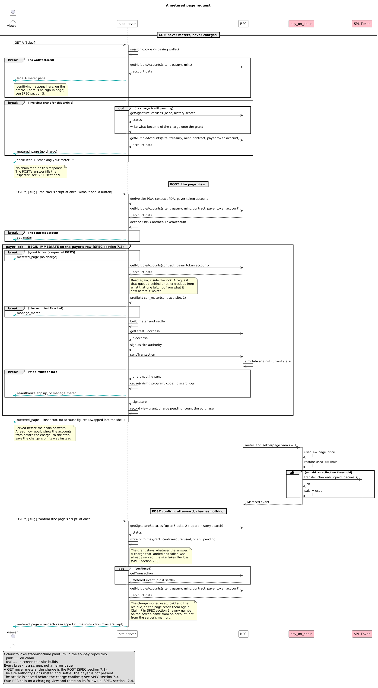

# Penny Press — specification

The sol-pay demonstrator site.

Status: draft, 2026-09-02, revised after review. Nothing is implemented. Platform choices are
deliberately open; they are collected in §12 and are the next decision, not
this document's.

Companion to [`sol-pay`](https://github.com/wbreeze/sol-pay). Where this
document and `wasm-client/SPEC.md` disagree about the library, that document is
right and this one is a bug. Where this document and the state diagram at the
sol-pay repository root disagree about the flow, the diagram is right.

## 1. What this is

**Penny Press** is a working site that meters a small set of articles with
sol-pay. Each interested person runs their own copy against devnet, with a mint
it issues on first run — see §12.0. There is no shared deployment and nobody
operates anything.

The name is the *New York Sun*, 3 September 1833: one cent a copy, sold in the
street by newsboys, against established papers at six cents and sold by annual
subscription. It is the closest historical parallel there is to what metering
proposes — unbundling a subscription into a price per item, at a price low
enough that the decision stops being a decision.

**The analogy is to the unbundling and stops there.** It is not an argument
about how those papers were funded, and the about page does not make one. Penny
papers did carry advertising, and someone will eventually raise it; the answer
is short and belongs here so it does not have to be improvised. Advertising in
1833 was classified notices in a four-page sheet. It was not audience
measurement, not behavioural targeting, and not the sale of a reader's
identity, none of which existed for another century and a half. Drawing a line
from one to the other compresses a hundred and ninety years into a single claim
and gets the history wrong in order to sound neat.

What this site argues is in §10.2 and in `content/privacy.md`, and it does not
depend on the 1830s at all.

It exists because `sol-pay-client` is a library that deliberately ships no
application. `wasm-client/SPEC.md` §1 lists three screens — `set_meter`,
`manage_meter`, `metered_page` — and says they are the integrator's to build.
Nobody has built them. Until someone does, every claim the library makes about
being integrable is untested, and the first integrator pays to discover what
the library forgot.

So this is two things at once, and the second is the one that constrains the
design:

1. **A demonstration.** Someone evaluating sol-pay reads the article, watches
   the meter move, and sees the transfer land on the explorer.
2. **The reference integration.** Someone who has decided to adopt sol-pay
   reads this repository to find out what they have to write. Every part the
   library does not supply — RPC, wallet adapter, session, the viewer-to-wallet
   map, the decision to meter, error attribution, log hygiene — appears here in
   one place, in the smallest honest form.

The second purpose is why the machinery is visible (§9) rather than hidden. A
demo that conceals the plumbing proves the reading experience is unobtrusive
and teaches nothing. This one shows both halves at once.

### What it is not

Not a product, not a template to fork into production, and not a CMS. It runs
on devnet with a token that is worth nothing, and it holds a signing key on a
web server, which is defensible only because that key controls nothing of
value. Both facts are stated on the site itself, not only here.

## 2. What the demo has to prove

The list is short and every item is falsifiable. If the finished demo cannot do
one of these, it has failed, whatever else it does.

| # | Claim | Where it is proven |
| --- | --- | --- |
| 1 | A reader with no relationship to the site can start paying in one wallet interaction | `set_meter`: `approve_and_open` is one transaction, one signature |
| 2 | Reading afterwards costs no interaction at all | The article path never touches the wallet |
| 3 | The site charges only when a charge is worth making | The settle fires on the tenth view, not the first |
| 4 | The payer's exposure is bounded by a number they chose | The limit stops metering, on chain, and the demo shows the block |
| 5 | Reaching the limit is an ordinary screen, not an error | `manage_meter` offers renew or close |
| 6 | Leaving costs nothing and leaves nothing behind | `close_and_revoke`, and the wallet shows no delegate afterwards |
| 7 | Every number on the screen came from an account, not from the server's memory | The inspector shows the decode beside the render |

Claim 7 is the one that makes the other six credible. A demo that reports its
own state proves nothing; this one reports what it read.

## 3. Shape

Three pieces, and the split follows `wasm-client/SPEC.md` §3 exactly — the two
consumers of the library sign different things and therefore run in different
places.

**Browser.** Holds the payer's wallet. Signs `approve_and_open`,
`approve_and_renew`, `close_and_revoke`, and the sign-in message. Uses the npm
package. Never sees the site authority.

**Server.** Holds the site authority. Signs `meter_and_settle` and nothing
else. Reads accounts over RPC, decodes them, runs preflight, decides whether
this request is metered, and delivers the article. Uses the crates.io crate.
Never sees the payer's key.

**Operator CLI.** Run by hand, not by the site. Creates the demo mint and the
treasury account, calls `initialize_site` once, and writes the resulting
addresses into the configuration the server and browser both read. Setup is a
separate program because it is rare, irreversible on a given deployment, and
needs authority the request path should not carry.

The article text is static content in the repository. There is no database of
articles and no editor.

## 4. Chain setup

### 4.1 The mint

The demo issues its own SPL mint, **DEMO**, six decimals. Six because USDC has
six, and an integrator reading this repository should see the same arithmetic
they will meet in production rather than a simplified version of it.

Its authority is the operator key. Nothing else can mint DEMO, and DEMO buys
nothing. The site says so.

Devnet USDC was considered and rejected: it makes the amounts read
realistically but puts the demo's ability to onboard a visitor behind a faucet
nobody here operates. A demo that cannot fund its own visitor is not a demo.

### 4.2 Site parameters

`initialize_site` takes three amounts. These are the demo's, in base units,
with the DEMO figure beside them:

| parameter | base units | DEMO | in views |
| --- | --- | --- | --- |
| `page_price` | 10_000 | 0.01 | — |
| `collection_threshold` | 100_000 | 0.10 | 10 |
| `min_limit` | 500_000 | 0.50 | 50 |

The program requires `page_price > 0` and `min_limit > collection_threshold`;
500_000 > 100_000 holds. The sol-pay README asks for a minimum limit of forty
or fifty times the page price, which is where fifty views comes from.

**`page_price` is a demo figure and not a recommended price.** It was chosen so
a visitor reaches the collection threshold in ten views, not from any analysis
of what an article is worth. The evidence says a real deployment would price
several times higher — every venture that has actually sold articles landed
between 10¢ and 40¢, and the break-even arithmetic against news ad revenue
agrees with them. `handoff/sol-pay/03-the-revenue-claim.md` has the numbers.
Nothing in the program constrains `page_price`, so this is a per-site decision
rather than a property of the design.

What the visitor experiences follows from those three numbers and is the reason
they were chosen: a settle transaction on the tenth article, and the limit on
the fifty-first. Both are reachable inside one sitting, which is the whole
requirement.

Fifty articles is more clicking than a visitor will do. §7.4 says how the demo
lets them skip ahead without lying about it, and why its step is seven views
rather than ten.

### 4.3 The faucet

A visitor arrives with a wallet holding no devnet SOL and no DEMO. The site
funds them:

- **0.05 SOL**, transferred from the site's own funded wallet — the one §12.0's
  setup page airdropped at first run — rather than requested from the public
  devnet faucet on the visitor's behalf. One reader against their own copy would
  probably survive the public faucet; routing it through the site keeps the
  faucet screen honest about who is paying, which is the site.
- **0.60 DEMO**, minted to the visitor's associated token account, creating
  that account idempotently in the same transaction. A little over one full
  minimum limit, and well under two.

That figure, and not a generous one, is deliberate. A visitor who opens at the minimum,
spends to the limit, renews and keeps going runs out of *balance* three clicks
into the second period — which is the second acceptance walkthrough in §13.2
and the only way to reach `diagnose`'s `balance_short` branch. A generous
faucet would make that state unreachable and quietly delete one of the two
failure modes the demo exists to show. The faucet's stinginess is a feature and
the site says so on the way past.

One grant per wallet address, and a rate limit per address and per source
address. The faucet is the only part of this demo with an abuse surface worth
naming, because it is the only part that gives anything away. What it gives
away is worthless, so the limit exists to keep the operator wallet solvent, not
to protect an asset.

**Two steps, on purpose.** A button opens a screen that says what is about to
happen — which wallet, how much SOL, how much DEMO, that it is once per wallet,
and that none of it is worth anything — and a second button on that screen
fires it. The screen carries its own way out that is not the browser's back
button.

One click that silently moves tokens into someone's wallet is exactly the
interaction pattern a reader should be suspicious of everywhere else. A demo
that trains the reflex out of them is teaching the wrong thing, whatever the
tokens are worth.

The faucet is a demo affordance and is marked as one on the screen. No
integrator should copy it.

### 4.4 Keys the server holds

Two, and they may be the same key:

- the **site authority**, which signs `meter_and_settle` and is what
  `has_one = authority` checks;
- the **faucet key**, which holds SOL to distribute and mint authority over
  DEMO.

Separating them costs nothing and is what a real deployment would do, so they
are separate here even though the demo would work with one. What custody a real
deployment owes this key is deferred to §15. Neither is in the
repository. Both are devnet keys controlling nothing of value, and the site
says that out loud rather than implying a security posture it does not have.

## 5. Identity

The library takes a wallet address and is silent about where it came from
(`wasm-client/SPEC.md` §4). The demo has to choose, and it chooses **Sign In
With Solana** over a server session, because §6.6 recommends exactly that and
ships none of it. The missing worked example is the one this repository owes.

The flow, all of it outside sol-pay:

1. Server generates a nonce, stores it against the pending sign-in with an
   expiry, and builds the SIWS message: domain, address, statement, uri,
   version, chainId, nonce, issuedAt, expirationTime.
2. Wallet displays and signs it, through the Wallet Standard `signIn` feature
   where present and connect-plus-`signMessage` over the same bytes where it is
   not. §6.6 notes Phantom has had `signIn` since extension 23.11.0; the
   fallback exists for everything older and for wallets that never added it.
3. Server verifies the signature against the message it issued, checks the
   nonce is one it generated and has not seen used, and **checks
   `expirationTime`**. A verifier that skips the expiry accepts a replay
   forever.
4. Server sets a session cookie holding the verified wallet address. Session
   cookie, `HttpOnly`, `SameSite=Lax`, `Secure`, no persistent "remember me".

That last property is not incidental. §4.2 of the library spec argues that an
authentication session cookie used only for authentication is the textbook
"strictly necessary" case and needs no consent banner, and the demo is only
entitled to that argument if the cookie actually behaves that way. It carries a
session id and nothing else. (Not legal advice; an integrator's counsel
decides.)

Neither the message construction nor the verification is written here. §6.6
names what to use — `@solana/wallet-standard-util`'s `verifySignIn` in the
browser, an existing `siws` crate on the server — and the reason is that two
implementations of one byte-exact format disagree eventually. The demo takes
that advice rather than demonstrating the thing the library declined to ship.

**The session is the viewer-to-wallet map.** That is the integrator's one
obligation (§4.1), and in this demo it is a cookie and a session store. A
publisher with accounts would put the address on the account row instead, and
nothing else in this design would change.

## 6. The viewer's path

Five screens. Three of them are the cyan nodes in the sol-pay state diagram;
the other two exist because a demo needs a front door and a wallet needs a
sign-in.

| screen | reached when | the payer signs |
| --- | --- | --- |
| index | always public | — |
| sign in | no session | the SIWS message |
| faucet | asked for, once per wallet | — (the site pays) |
| faucet confirm | from the faucet screen | — |
| `set_meter` | session, no contract | `approve_and_open` |
| `metered_page` | session, contract, `can_meter` passes | — |
| `manage_meter` | limit reached, or navigated to at any time | `approve_and_renew` or `close_and_revoke` |
| privacy | always public | — |

**`manage_meter` is reachable at any time**, not only at the limit. Decided
2026-09-02, reversing an earlier decision that it should be limit-only.

The state diagram draws no route in below the limit, and reading it as a
prohibition was the error. It draws the *metered path*; it does not enumerate
the site's navigation. A reader who has authorized a site to draw from their
wallet may reasonably expect to find, at any moment and without exhausting
anything first, a page that says what they have spent and offers a way out.
Making them hit a limit first to reach the exit is not a defensible product,
whatever the diagram omits.

So `manage_meter` carries a permanent link from the meter widget, and its
delete path — `close_and_revoke` — is available from the first page view
onward. That is what makes claim 6 in §2 true, acceptance step 9 reachable, and
`content/privacy.md`'s promise that a reader can close whenever they like an
accurate statement rather than an aspiration.

### 6.1 Index and teasers

The index lists the articles. Each article page is two parts: a **lede** that
is public and unmetered, and a **body** that is not.

The lede is not decoration. It gives the server something honest to render to a
visitor who has no contract, so `set_meter` can appear beside real content
instead of as a wall. It is also what makes claim 2 in §2 observable — the
visitor sees the same page twice, once truncated and once whole, and the only
thing that changed was a contract account.

### 6.2 A metered request, end to end



The source is `metered-request.plantuml` at the repository root, rendered with
`plantuml -tpng`, on the same convention as `state-machine.plantuml` in
sol-pay. Its colours follow that diagram's: pink is on chain, teal is a screen
this site builds. Regenerate the PNG whenever the source changes.

Every branch that leaves this diagram early is a screen, not an error page.
That is the point of claim 5.

### 6.3 Mobile

In scope, decided 2026-09-02, and promoted out of the non-goals because it is
what people actually do. A demonstration of metered reading that only works at
a desk is demonstrating something nobody does.

It is not one extra path. It is two, and they share almost nothing.

| | Android | iOS |
| --- | --- | --- |
| mechanism | Mobile Wallet Adapter, from mobile Chrome | none — the page must be opened *inside* a wallet's own browser |
| library | `@solana-mobile/wallet-standard-mobile`, `registerMwa()` | nothing; the in-app browser injects a Wallet Standard provider |
| how the reader arrives | normally | a user-clicked "open in Phantom / Solflare" link |
| SIWS `signIn` | supported | feature-detect, fall back to `connect` + `signMessage` |

**Android.** MWA registers as a Wallet Standard wallet and the rest of the
integration is the desktop one. Four constraints that are not obvious and each
of which breaks the flow outright:

- **Chrome for Android only**, over **HTTPS** — the support check tests
  `window.isSecureContext` and an Android user agent, so there is no
  plain-`http` local development shortcut.
- **Pin `@solana-mobile/wallet-standard-mobile` at 0.5.0 or later.** Chrome 142
  introduced a Local Network Access permission prompt that breaks MWA's local
  association; 0.5.0 and later handle it. Other browsers are adopting the same
  prompt.
- **Every wallet call must originate from a real user gesture.** Android
  Chrome's trusted-event policy blocks the intent navigation otherwise, which
  rules out connecting from an effect on page load — and is a second reason to
  use `signIn`, which is one gesture rather than connect-then-sign.
- **Register it client-side only**, never during server rendering.

**iOS has no Mobile Wallet Adapter and is not going to have one soon.** MWA
needs a persistent local socket between page and wallet, and iOS suspends
backgrounded apps; the specification has said "planned for a future version"
for years. Every iOS browser is WebKit under the same rules, so this is not a
Safari quirk to route around. There are no Solana wallet extensions for iOS
Safari worth building on — Solana Mobile archived its own Safari extension
library in August 2026.

What is left is the wallet's in-app browser, which injects a provider and
behaves like the desktop case once you are inside it. Getting there is a link
the reader clicks — `https://phantom.app/ul/browse/<encoded url>` or
`https://solflare.com/ul/v1/browse/<encoded url>`. Both vendors are explicit
that these must be clicked, not issued as a programmatic redirect.

So the iOS path is a *screen*, not a code path: detect iOS outside a wallet
browser, explain in one sentence that a wallet's browser is needed and why, and
offer the two links. That is more honest than a connect button that cannot work
and is less work than the alternative.

**What is deliberately not built:** the encrypted deep-link protocol
(`phantom.app/ul/v1/...`). It works, and it costs an x25519 keypair persisted
across app switches, TweetNaCl in the page, a session token, base58 rather than
base64 payloads, and a return that can land in a *new browser tab* with the
page's state gone. That is a large amount of machinery, none of it about
metering, for readers who declined to open the in-app browser.

**One property of sol-pay makes all of this much easier than it would otherwise
be, and it is worth stating.** Every transaction the payer signs —
`approve_and_open`, `approve_and_renew`, `close_and_revoke` — has exactly one
signer, the payer. The site never co-signs and never needs the signed bytes
back. So all of them work through `signAndSendTransaction`, which is the method
MWA 2.0 guarantees; `signTransactions` is listed there as deprecated. A design
that needed the site to counter-sign would have run into that immediately.

**One that makes it harder.** A blockhash has to survive an application switch.
Fetch it immediately before handing off, and be ready to rebuild and retry when
the reader takes thirty seconds in their wallet. This does not arise with a
desktop extension popup and it will arise on the first real device.

## 7. The metering decision

This section is the one an integrator comes here for. The library says
`can_meter` "reports whether a charge would succeed, not whether it should
happen. Only the site knows that." Everything below is this site knowing it,
and every rule here is the demo's policy rather than sol-pay's.

### 7.1 One charge per article, not per request

A request is not a page view. A refresh is a request. So is a back button, a
browser prefetch, a bot, a double-submitted form, and the inspector re-reading
its own panel. Metering each of them charges a reader several times for one
article and is the defect most likely to be shipped by an integrator who wires
`meter_and_settle` straight into a route handler.

The demo issues a **view grant**: on a successful meter, the server records
`(wallet, article, expires_at)` with a thirty-minute life. A request that finds
a live grant is served without touching the chain.

Thirty minutes is a policy number with no chain meaning, and it is settled at
thirty. It says a reader who paid for an article may finish it, follow a link
away, and come back. A publisher who wanted per-session or per-day grants would
change one constant and nothing else.

Someone will ask for "pay once, keep it forever", and the answer is the whole
reason a window exists: **a permanent entitlement requires permanent memory.**
Either the reader carries the permission with them, or the site remembers them
indefinitely — and the second is the thing §10.4 is built to avoid. The
expiry is not stinginess. It is what makes forgetting possible at all.

The window is bounded on both sides by something real. Longer, and the claim
not to be tracking readers dilutes until it stops meaning anything. Shorter,
and reading starts to feel like a race against a clock. A reader returning
after a long gap is deriving fresh value and can pay a cent for it.

And the window is not a protection mechanism. Anyone can copy, paste or cache
what they have paid for. What the site sells is metered access to the site; the
content itself is protected by its licence and by very little else. A grant is
a rental window, not DRM, and nothing in this design should be built as though
it were.

The grant is keyed by article rather than by request because that is what
"a fee per page view" means when the site is honest about it. Charging for a
refresh is not metering, it is a billing bug with a chain underneath.

### 7.2 One meter at a time per payer

Two requests from one reader that both reach the metering step build two
`meter_and_settle` instructions against the same contract account from the same
read. They do not conflict on chain — the program increments whatever it finds
— so both succeed and the reader is charged twice for a race they did not
cause.

The server therefore serializes the read-preflight-meter-confirm sequence per
wallet address. Requests for that wallet queue; the second one, arriving after
the first recorded its grant, finds the grant and never meters.

The demo does this with a transaction on the payer's row in its SQLite store
(§12.5), so the lock and the state it guards are the same object. **Any
deployment running more than one instance needs a lock that spans them**, and
that is a real constraint on §12's hosting decision rather than an
implementation detail — one file on one machine is not such a lock.

**How this is tested:** two browsers, one wallet, the same article requested
simultaneously. The pass condition is one `meter_and_settle` on chain and one
grant, with the second request served from that grant. Asserting it needs the
inspector's event log rather than the rendered page, since both browsers show
the same article either way — which is the point: the defect this prevents is
invisible from the front end.

### 7.3 Order, and who absorbs an ambiguous confirmation

Meter, confirm, record the grant, then render. The grant is recorded before the
body is rendered so that a render failure still leaves the reader holding what
they paid for.

Confirmation can be ambiguous: the transaction was sent, the confirmation did
not arrive inside the timeout, and it may or may not have landed. The demo
polls signature status for a bounded window, and if the answer is still
unknown, **serves the article and records the grant anyway**, flagging the
request in the inspector as unconfirmed.

The reasoning is that the two failure modes are not symmetric. Refusing to
serve risks charging a reader for nothing, which is the failure that destroys
trust in a payment system. Serving risks giving away one article at
`page_price`, which for this site is 0.01 DEMO and for a real one is a cent.
The site absorbs the cheaper error. An integrator who disagrees should
disagree explicitly rather than inherit this by accident, which is why it is
written down.

### 7.4 Advancing the meter on purpose

`meter_and_settle` takes `page_views: u32`, and the demo exposes it: a control
that meters **seven** views in one instruction, so a visitor can reach the
limit inside a handful of clicks instead of fifty page loads.

**Seven, and not ten.** Ten is the collection threshold, so a ten-view step
would settle on every single click and the reader would conclude that metering
means a transaction per charge — which is the opposite of what the design is
for. Seven is below the threshold, so the settle fires on some clicks and not
others:

| click | `used` | `unpaid` before | settles? | `paid` after |
| --- | --- | --- | --- | --- |
| 1 | 0.07 | 0.07 | no | 0.00 |
| 2 | 0.14 | 0.14 | **yes** | 0.14 |
| 3 | 0.21 | 0.07 | no | 0.14 |
| 4 | 0.28 | 0.14 | **yes** | 0.28 |
| 5 | 0.35 | 0.07 | no | 0.28 |
| 6 | 0.42 | 0.14 | **yes** | 0.42 |
| 7 | 0.49 | 0.07 | no | 0.42 |
| 8 | — | — | blocked: `LimitReached` | 0.42 |

Three things fall out of that table that no amount of prose achieves. The
settle is *intermittent*, which is the whole economic argument for a collection
threshold. The reader is blocked at 0.49 against a limit of 0.50 — because
`can_meter` asks whether `used + charge <= limit`, not whether any of the limit
remains. And they arrive at the limit carrying 0.07 unpaid, which is exactly
the residue that `limit_floor` folds into the renewal minimum and that
`close_contract` forgives. The demo does not have to explain any of that; it
has to let someone click eight times with the inspector open.

Mixed with real reading the pattern stops being a cycle and starts being
arithmetic the reader has to look up, which is better still.

It is labelled as a demo control and it charges honestly — seven views is seven
views, the reader's `used` moves by 0.07 DEMO, and the resulting transfer is a
real transfer. It is not a simulation. It is the same instruction the site
would send if the reader had actually read seven articles, which is exactly why
it belongs in a demonstration of the API: `page_views` is in the instruction
because batching is expected, and this is what batching looks like.

It also makes visible the property the sol-pay README states plainly — the
limit is trust, not pacing. A site can draw straight to the limit whenever it
likes, and here is a button that does it. Better a reader meets that fact in a
demo where the money is fake.

### 7.5 What the demo does not decide

`wasm-client/SPEC.md` §4.4 warns that a contract is not a viewer type and that
keying access off "has a contract" eventually charges a subscriber. The demo
has no subscriptions, so it cannot demonstrate the coexistence — but the
decision point is still in the code, as a single function that answers "should
this request be metered at all", returning true for every article here. It
exists so an integrator can see where their entitlement check goes.

## 8. When the chain says no

### 8.1 Attribution

A failed transaction gives a numeric code, and the number alone does not say
whose it is: `LimitReached` is 6003 from the metering program, `InsufficientFunds`
is 1 from SPL Token. The server extracts the raising program and the code from
the transaction logs and hands both to `error::cause`, which returns
`Program(PayError)`, `Token(TokenError)`, or `Unknown { program, code }`.

Log handling is the part the sol-pay README asks integrators to think about:
transaction logs and account lists carry the payer's wallet address, and the
program's events carry `used`, `paid` and `transferred` as decodable base64.
None of it is secret and all of it is on chain — but copying it into an
application log or an error tracker moves a reader's spending history into
systems that were never scoped to hold it.

So the demo's log handling has one rule, and the code enforces it in one place:
**the parser returns a `Cause` and a signature, and drops everything else
before it returns.** Raw logs never reach a log line, a metric, or a response
body. The inspector shows the decoded `Cause` and a link to the explorer, where
the person who owns the wallet can read their own logs.

### 8.2 The branches

Anchor numbers `#[error_code]` variants from 6000 in declaration order, which
fixes these:

| code | cause | raised by | what the reader sees |
| --- | --- | --- | --- |
| 6003 | `LimitReached` | `meter_and_settle` | `manage_meter`: usage wrapup, renew or close |
| 6004 | `DelegateNotSet` | `open_contract`, `renew_contract` | the approve did not land, or landed after; the pair in `core::tx` is what prevents it |
| 6005 | `DelegateMismatch` | `open_contract`, `renew_contract` | the wallet's token account is delegated elsewhere (§8.3) |
| 6006 | `DelegateAllowanceTooLow` | `open_contract`, `renew_contract` | the approved amount does not cover the limit asked for |
| 6007 | `LimitBelowUsage` | `renew_contract` | the renewal screen's own `limit_floor` check should have caught this; if it appears, the screen is wrong |
| 1 (SPL) | `InsufficientFunds` | the `transfer_checked` CPI inside `meter_and_settle` | ambiguous — see below |
| — | `Unknown` | anywhere | the program address and the code, and a link. No guess. |

The `raised by` column matters more than it looks. The program checks the
delegate in `open_contract` and `renew_contract` and **not** in
`meter_and_settle` — metering leans on the delegation the token program
enforces during the transfer. So a reader who revokes their approval between
opening and reading does not get 6004; they get SPL Token's error from inside
the CPI, which is the ambiguity the next paragraph is about.

`InsufficientFunds` is ambiguous by construction: SPL Token appears to return
it both for a short balance and for a short allowance, and the two need
opposite responses. The demo answers it the way §6.4 prescribes — read the
payer's token account, call `diagnose(account, unpaid)`, and act on the
`Shortfall`:

- `balance_short > 0` — the wallet is short. On this demo, offer the faucet. A
  real site says "top up".
- `allowance_short > 0` — the approval no longer covers the limit. Offer
  renewal, which re-approves.
- both — show both, in that order, because a re-approval the balance cannot
  cover fixes nothing.

`Shortfall` is a struct and not a verdict for exactly this reason, and the demo
is the site making the choice the library refused to make for it.

### 8.3 The one-delegate consequence, and the objection it raises

An SPL token account has exactly one delegate, and `approve` replaces it rather
than adding to it. So a reader who has an open contract with one sol-pay site
cannot open one with a second site **using the same token account**: the second
`approve` silently repoints the delegate, and the first site's next settle fails
inside the token program.

**This is not a property of the demo's mint.** It is SPL Token's account layout
— one `delegate`, one `delegated_amount` — and it is identical for USDC, and
identical again under Token-2022. The obvious objection follows immediately:
*if this were widely adopted with USDC, could a reader only ever be metered by
one site at a time?* It is the first question a serious evaluator asks, so it
is answered here rather than left to be discovered.

**The answer is no, and the reason is in the program's account constraints.**
`payer_token_account` is constrained in both `OpenContract` and
`MeterAndSettle` by exactly two things:

```rust
constraint = payer_token_account.owner == payer.key(),
constraint = payer_token_account.mint  == site.mint,
```

There is no associated-token-account constraint. Any token account the payer
owns for the site's mint is acceptable — and a wallet may own arbitrarily many
token accounts for one mint, the ATA being merely the canonical one. **One
token account per site gives one delegate per site, and a reader can hold as
many concurrent contracts as they have token accounts.**

That is a real answer, and it is not a free one. The costs, stated plainly:

- **Rent.** Each token account is 165 bytes and costs roughly 0.002 SOL,
  recoverable when it is closed.
- **Split balances.** Balance is per account, not per wallet, so the reader has
  to decide in advance how much USDC to park with each site — which is a second
  budgeting decision on top of the limit, and a worse one, because it is
  invisible in most wallet interfaces.
- **Wallet support.** Wallets show the ATA. Auxiliary token accounts for the
  same mint are second-class in nearly every interface, and asking an ordinary
  reader to create and fund one is not a viable onboarding step today.
- **A second integrator obligation.** `wasm-client/SPEC.md` §4.1 says the
  payment core needs exactly one input, the payer's wallet address. That holds
  only while everyone uses the ATA. A site that supports auxiliary accounts must
  store *which* token account this reader uses alongside the address, because
  `meter_and_settle` takes it as an account and the `Contract` does not record
  it.

So the honest summary is: **the constraint is per token account, not per
wallet; the workaround exists on chain today and is not yet practical in a
wallet.** Anyone evaluating sol-pay should hear both halves.

Two designs would remove the friction rather than route around it, and neither
is this demo's to choose:

- **A per-payer delegate PDA.** If the delegate were seeded `[b"delegate",
  payer]` rather than being the per-site contract PDA, one approval on the
  reader's ATA would cover every site on that deployment, with each site's
  exposure still bounded on chain by its own `Contract.limit`. The trade is that
  the allowance becomes a shared pool: a site that draws hard leaves less for
  the others, and a reader's total exposure is the allowance rather than the sum
  of limits they agreed to.
- **Per-site escrow**, which `wasm-client/README.md` already names: the reader
  tops up an account the site draws from. It removes the delegate question
  entirely and gives up the property the whole design is built on, that the
  money stays in the reader's wallet until it is spent.

**What the demo does.** It uses the ATA, so within the demo a reader has one
contract, which is all one site needs. What it owes the reader is not to spend
their signature on a transaction that cannot succeed: the payer's token account
is already decoded on the `set_meter` screen for the balance display, so its
`delegate` field is in hand. It either names this site's contract PDA, names
something else, or is empty. When it names something else, the screen says so
and explains the choice — close the other contract, or use a different token
account — instead of asking for an approval that will fail as
`DelegateMismatch` after the reader has paid a fee.

That is preflight in the general sense the library means it: check what the
program will check, before the payer pays to be told.

## 9. The inspector

A panel, present on every screen, collapsed by default and one click from any
page. It is the artifact that turns a demo into a reference, and claim 7 in §2
is its job.

Four sections:

**Addresses, under short aliases.** Base58 is unreadable and, worse,
*comparable-looking*: two addresses sharing four leading characters read as the
same address to a human eye scanning a panel. So every address the demo shows
gets a short alias, displayed beside the real thing here and used alone
everywhere else on the site.

An alias is a role prefix plus a nonsense syllable:

| prefix | what it names |
| --- | --- |
| `PID` | the metering program id |
| `SPDA` | the site PDA |
| `CPDA` | the contract PDA |
| `MINT` | the DEMO mint |
| `TRSY` | the site treasury token account |
| `PAYR` | the reader's wallet |
| `PATA` | the reader's token account |
| `TKPG` | the token program |

giving `PIDalpha`, `SPDApep`, `CPDAcat`, `PAYRfig`.

**The syllable is derived from the address, not assigned in order.** Index a
fixed word list by a byte of the address's hash, so the same address always
draws the same alias — for every reader, in every session, and after a redeploy.
An alias that is stable is a thing two people can say to each other on a call
while looking at their own screens; an alias that is positional is a lie the
first time the panel reorders.

Two rules that keep this a convenience rather than a hazard. The full base58 is
always one click away and always what gets copied — a copy button never yields
an alias. And the aliases are this site's invention, not a standard, which the
panel says once, so nobody leaves thinking `CPDAcat` means anything to a wallet
or an explorer.

Each address also carries the derivation that produced it —
`[b"contract", site, payer]` — and a link to the devnet explorer.

**Decoded accounts.** `Site` and `Contract` field by field, in the order and
sizes of `wasm-client/SPEC.md` §6.2, with amounts shown both as base units and
through `from_base_units`. Plus the payer's `TokenAccount`: amount, delegate,
delegated amount. The point of showing both unit forms is that the six-decimal
scaling error the library's §6.2 warns about — turning 50 into 50,000,000 — is
invisible until you see the two numbers side by side.

**Preflight, for this request.** `charge(1)`, `can_meter`, `will_settle`,
`views_remaining`, `limit_floor`, `required_allowance` — each with its value and
the on-chain check it mirrors. When the current screen is `manage_meter`, the
reader can see that `can_meter` returned `LimitReached` and why.

**The last transaction.** Signature and explorer link, the instructions as the
builders produced them — program, accounts in order with signer and writable
flags, data as hex — and the decoded `Metered`, `Renewed` or `Closed` event.

Showing the instruction bytes beside the transaction is what makes the demo
useful to someone who is about to write their own. It is also a live check on
the library's claim that its output drops straight into a transaction message.

## 10. Content

### 10.1 The articles

Roughly twelve pieces, markdown in the repository, each with front matter for
title, slug, lede and reading time. No external CMS, no fetch at request time,
no images beyond what the text needs.

Twelve rather than eight so that a reader who works through the publication
reaches the ten-view settle by reading, and meets §7.4's control as an
accelerant rather than as the only way to see a transfer happen.

**The material is the sol-pay development sessions themselves**, edited. Each
piece is one decision and the argument that produced it — why the bump slug was
removed, why the library ships no sign-in, why `approve` must come first, why
`limit_floor` is one function rather than two, why `Shortfall` is a struct and
not a verdict. The conclusions are already in `wasm-client/SPEC.md` in three
terse sentences each; the sessions are where the reasoning lives, including the
positions that were argued and abandoned.

Three editorial constraints, because the difference between this being good and
being unreadable is entirely in the editing:

**Episodes, not transcripts.** A raw session is long, doubles back, and spends
most of its length on things that did not survive. Each piece is written *from*
a session, keeps the objection that changed the outcome, and drops the rest. If
a piece cannot state in its lede which decision it is about, it is not a piece
yet.

**Show the process, do not argue for it.** The claim worth making — that the
artifact is better for having been argued out with an AI than it would have
been alone — is made by exhibiting a decision that visibly improved under
challenge, and is destroyed by asserting it. The strongest pieces will be the
ones where the first proposal was wrong, and say so.

**Scrub before publishing.** Sessions carry local filesystem paths, absolute
usernames, key material, half-formed opinions about third parties, and dead
ends that read as commitments. Every piece is read once with that list in hand
before it becomes content, and that pass is a checklist item rather than a
habit.

There is a pleasing circularity in metering this particular material: the
reader is paying a cent to read why the thing charging them the cent works the
way it does. It is also a fair test of the proposition, since the content has
to be worth a cent to someone, and nobody has to take the demo's word for it.

### 10.2 The privacy page

The site carries a page at the URL a privacy policy would occupy. It is not a
privacy policy. It is the complete list of what the site holds, followed by the
argument that the list is short because of how the reader is paying.

Public, reachable without signing in, and linked from the footer of every page.

**The argument, in three moves.**

1. *Here is everything.* Not a summary of categories, not "we may collect" —
   the actual stores, enumerated, each one traceable to a line in the code. The
   list fits on a screen. That it fits is the entire point.
2. *The list is short because the payment rail carries no identity.* An
   ad-funded publisher builds an identity graph because it has no way to charge
   a reader a cent; the reader pays with attention and with data because there
   was no other currency available. Metering supplies the other currency. The
   trade-off is explicit and it is not free: the reader pays money instead.
3. *The wallet is not a name.* The site does not know who the reader is, does
   not ask, and holds nothing that would answer the question.

**Move three has a caveat, and the caveat is what makes the page credible.**

A wallet address is pseudonymous, not anonymous. Addresses are linked to people
every day — by KYC at an exchange on- or off-ramp, by address reuse across
services, by chain analysis, by timing. None of that is something the site
does, and the page says so.

But the site is not a neutral bystander either, and this is the part the brief
did not have. `wasm-client/SPEC.md` §4.3: contracts are readable by anyone, so
given this site and a wallet address, the limit, used and paid figures are on
chain in the clear. **The contract account is a public, permanent record that
this address paid this site, and the site is what caused it to exist.** It is
inherent in putting a spend meter on a public ledger and no client library can
change it — but "we did nothing to expose you" is not accurate, and the library
spec asks integrators to tell readers plainly rather than reassure them.

So the page states it as a cost to weigh, in the same breath as the benefit.
A page that admits the one real exposure is believed about the rest; a page
that claims anonymity is not, and deserves not to be.

**What the page must not claim.**

- That a site running this in production needs no privacy policy. It processes
  a pseudonymous identifier, an IP address, and a reading history, and whether
  that triggers an obligation is a question for its own counsel in its own
  jurisdiction. The page's claim is about *this* site, and even here it is
  "there is nothing to disclose that is not disclosed", not "no law applies".
- That the wallet is anonymous. Pseudonymous, and the difference is the page.
- That the reader cannot be correlated. The site cannot promise that about
  systems it does not run.
- Any legal conclusion at all. The page argues from what the code does.

**Every claim on it is testable.** The enumerated stores are the ones the
implementation has; the third-party claim is §10.3; the "we do not keep
transaction logs" claim is the single-place rule in §8.1. A claim on this page
that the code does not support is a defect of the same class as a wrong
instruction encoding, and reviewing the page against the code belongs in the
release checklist rather than in someone's memory.

A draft is at `content/privacy.md`.

### 10.3 No third-party requests

A build constraint rather than a preference, because §10.2 makes a claim about
it that has to be true: **the site loads nothing from a domain it does not
control.** No analytics, no tag manager, no CDN-hosted fonts or scripts, no
embedded media. Fonts, styles and scripts are served from the site's own
origin.

Hosted fonts are the specific trap. A font pulled from a third-party CDN sends
every reader's IP address and referring page to that CDN on every page load,
which would make the privacy page's central claim false in a way nobody would
notice while writing it.

**The RPC endpoint is the same problem wearing different clothes, and it lands
on the §12.4 decision.** If the browser talks to an RPC provider — to send the
payer's transaction, or to keep the inspector live — then the reader's IP
address reaches that provider, correlated with a wallet address, and the site
has introduced a third party to the transaction after promising it had not.
Two consequences:

- The **inspector reads through the server**, not from the browser (§14 lists
  live-versus-per-request as open; this decides part of it — if live polling
  ever happens, it polls the site, and the site polls the chain).
- The **wallet's own RPC is outside the site's control and is disclosed rather
  than solved.** A wallet extension broadcasts through whatever endpoint its
  owner configured. That is the reader's relationship with their wallet vendor,
  the site cannot change it, and pretending otherwise would be the same error
  as the fonts.

Verification is mechanical: load every screen with devtools recording, and
assert that no request leaves the origin. Worth a test rather than an
inspection.

### 10.4 Erasure — what goes away, when, and what cannot

Decided 2026-09-02. **Closing the contract purges the site's record of the
reader.** The premise is the reader's, and it is right: closing a contract is
the reader saying the relationship is over. A site that keeps their reading
afterwards has not understood what it was told.

But this section is more than that one rule, because §7.1 introduced something
the rest of the design was built to avoid. To stop charging twice for one
article, the site records which articles a wallet has paid for. That is a
reading history. It is small and it is short-lived, and it is still the exact
category of data this project exists to argue against holding.

The right response is not to be defensive about it. It is to say what it is,
bound it, and let the bound be checked.

| store | contents | goes away |
| --- | --- | --- |
| session | wallet address | sign out, contract close, or session end |
| view grants | wallet, article, expiry | 30 minutes — or at once, on close |
| faucet ledger | wallet, time | never — see below |
| request logs | IP, path, time | short rotation, never keyed to a wallet |

**Closing also signs the reader out.** The session existed to tie a wallet to a
browser so it could be charged. With nothing left to charge, it has no purpose,
and leaving it in place while claiming to have forgotten them would be a
contradiction sitting in a cookie.

Five qualifications. The first four are why the rule is not as strong as it
sounds; the fifth is what keeps it honest.

**1. Expiry does the work. Closing is a courtesy.** Most readers will never
close anything — they will simply leave. If erasure happened only on an
explicit close, then the readers who most look gone would be exactly the ones
whose data persisted longest, and the promise would be structured to be kept
for the minority who ask and quietly broken for everyone else. So the claim
rests on the thirty-minute expiry, which applies to everybody and needs no
action. Closing accelerates something that was already going to happen.

**2. It costs the reader an article, and they are told before they click.**
Purging live grants means an article they have paid for stops being served. The
exposure is bounded at one page price, which the site absorbs elsewhere anyway
(§7.3), and it is stated on the close confirmation rather than discovered.

This **replaces** the earlier answer to the grant-live-after-close case. With
purge-on-close there is almost nothing left to resolve: the reader who closes
in one tab and refreshes in another finds no session and no grant, and lands on
`set_meter` with the message that the site has honoured their decision to stop.
Serving the paid article on after a purge would have been a thirty-minute
asterisk on a promise that is otherwise simply true, and a promise with an
asterisk is worth less than the article.

**3. The faucet ledger survives, and the reason it is allowed to is specific.**
If closing purged it, close-and-refaucet would be a loop and the demo would be
a token dispenser. The exception is defensible because **the record duplicates
a public fact**: the faucet's mint is an on-chain transaction naming that token
account forever, so the site's row adds no exposure the ledger does not already
carry, and could in principle be replaced by a chain query instead of a store.
That reasoning is the sort of thing that has to be published to count. An
undisclosed exception to an erasure promise is not an exception, it is the
promise being false.

**4. The thing nobody can delete is the ledger, and closing writes to it.**
`close_contract` emits `Closed { contract, forgiven }`. The reader's instruction
to be forgotten is itself recorded, publicly and permanently, by the act of
giving it. That is not an argument against closing — it is the sharpest
available illustration of §10.2's caveat, and it belongs on the close
confirmation screen *before* the click, where it can still inform a decision.

**5. Aggregates are allowed. Three conditions make them aggregates.** How many
times a page was bought is a fact about the page, not about anybody, and a
publisher who cannot know what gets read is being denied something ordinary for
no one's benefit. An earlier draft of this section forbade all of it, which was
wrong. The line is not "no numbers"; it is these three:

- **Counts, not joins.** A per-article purchase total is a fact about the
  article. "Readers of this also read that" is a preference profile wearing
  aggregate clothing, and it is precisely the machinery this project exists to
  do without. The distinction is whether the statistic is about the content or
  about a person reconstructed across articles.
- **The count must not need the row.** Increment, then let the grant expire or
  be purged on close. If deleting a reader's data would change what the site
  can still compute, the data was never aggregate — it was a profile with a
  total on top.
- **Mind the public ledger.** This one is specific to a chain and is easy to
  miss. A per-article counter that moves in real time, sitting beside a public
  ledger of timestamped `Metered` events, is a correlation channel: on a
  low-traffic article, one settle in a window plus one increment in the same
  window joins a wallet to a title, and nothing in either source had to be
  careless for that to work. Internal counts are fine. Published counts should
  be coarse in time, or withheld below a threshold, or both.

**What the grant store is, precisely** — the distinction worth making rather
than blurring, because the privacy page's whole argument depends on it. A grant
answers one question: *has this wallet already paid for this article?* It is a
receipt. It is never joined across articles to describe what a reader likes, it
never leaves the server, it feeds nothing, and it expires. The tracking this
project argues against is not the keeping of a receipt; it is the construction
of a preference profile from receipts, and the two are separated by exactly the
rule in point 5.

**Testable, and tested.** Close a contract, then assert from outside that the
session is gone, no grant remains for that wallet, and a request for a
previously granted article routes to `set_meter`. An erasure claim that nothing
checks is an erasure claim that will be wrong within two releases.

## 11. Non-goals

Stated so they are not mistaken for oversights:

- **Production hardening.** No HA, no monitoring, no backups. The session store
  may be memory. Key *custody* is a non-goal for the demo's own deployment but
  not for its documentation: §15 owes integrators a written answer.
- **Mainnet, or any real money.** Claim-checking the design against real value
  is a different exercise with different obligations.
- **Multiple sites, or Token-2022.** One deployment, one site, one SPL Token
  mint. `Program::new` and `with_token_program` exist and are worth showing in
  the inspector as the defaults they are, but the demo exercises one path.
- **Subscriptions.** §7.5 leaves the hook and nothing more.
- **The encrypted wallet deep-link protocol.** Mobile itself is in scope
  (§6.3); the raw `ul/v1` protocol is not.
- **Gift links.** The library removed the slug that would have made these
  possible and explained why (§4.2). Not reintroduced here.
- **Anything the library refused to ship.** No sign-in message construction, no
  second error enum, no RPC wrapper worth publishing. Where the demo writes
  something the library declined to, it is the site's own and is marked as
  such.

## 12. Platform

Revised 2026-09-03, and closed 2026-09-04. The deployment shape settled most of
what this section used to be open about; §12.1 settled the rest, and §12.5 was
revised in the same pass as a consequence of it. Nothing here is open.

### 12.0 The shape, decided

**Each interested person runs their own copy, against devnet, as a local
process.** Nobody operates a shared instance.

That single choice resolves a cluster of problems the earlier draft treated as
independent. There is no RPC provider to choose, because one reader against the
public endpoint is nowhere near a rate limit. There is no operator faucet to
keep solvent, no shared signing key, no uptime obligation, and no abuse
surface, because there is nothing shared to abuse.

**Devnet specifically, not testnet.** Testnet is where validator releases are
exercised and it is reset aggressively; devnet is the cluster intended for
application development and is what every wallet lists as a network. A demo on
testnet loses its program and every contract to the next reset.

**Local process, remote chain.** Two alternatives were considered and rejected,
and the reasons are recorded so they are not rediscovered:

*A deployed public instance* reaches people who will not clone a repository,
which is worth something — but §1 names integrators as the audience, and an
integrator will clone. It costs an operated faucet, a live key, and a demo that
is broken in public whenever it is broken, which is worse than no demo.

*A local validator* is more attractive than it turns out to be. It would make
§13's walkthroughs deterministic and automatable, which is a real prize. It
does not work with wallets. No wallet supports an arbitrary custom RPC —
Phantom announced it in 2022 and never shipped it, and Backpack, which does
support custom RPC, publishes a page explaining that localhost specifically
cannot work because the URL is resolved by its backend. Worse,
`signAndSendTransaction` submits through the *wallet's* RPC, so on a local
validator a transaction silently lands on devnet; there is a Phantom issue
where transactions appeared to succeed with the local validator stopped. A
reference integration that modelled that pattern would be teaching a trap. And
mobile is impossible outright: MWA 2.0 defines no localnet chain, the
specification says the wallet chooses the RPC, and a LAN address is not a
secure context so MWA's own session setup cannot run.

**Nobody but the program's publisher builds the program.** `pay-on-chain` is
deployed to devnet once; `wasm-client/SPEC.md` §4.5 already establishes that one
deployment serves many sites, because the `Site` PDA is seeded by authority. So
a person running this demo creates their own mint, treasury and site against
that deployment. They need no Anchor, no Solana CLI, no validator, no wasm
target, and cents of devnet SOL for rent.

**Which is why there is no container.** An earlier draft reached for Docker to
pin the Anchor and Solana toolchains. Nothing here builds a program any more,
so the prerequisite is one language runtime and one package from a registry.
`npm run dev` or `php -S`, not `docker compose up`.

**And first-run setup is a page, not a command.** Creating the mint, the treasury account and the `Site`
would ordinarily mean a CLI, a generated keypair and an airdrop command — three
chances to fail before anything has been demonstrated.

None of it needs a CLI. Every step is available over plain JSON-RPC, including
`requestAirdrop` on devnet. So the first run of the server opens a setup screen:
it generates the site authority keypair server-side, airdrops it, creates the
DEMO mint, creates the treasury token account, calls `initialize_site` with the
parameters in §4.2, and writes the configuration file. The operator starts a
process, opens a page, and clicks once. They never handle a keypair and never
open a terminal after the start command.

It also earns its place as documentation. `initialize_site` is part of the
library's published surface and has no worked example anywhere.

### 12.1 Server language — decided: PHP

**Decided 2026-09-04: PHP, with Slim 4 as the framework.** The front end is
JavaScript either way (§12.2); this was only ever about what runs the server
half.

Both routes cleared their one unproven thing before the choice was made, so it
came down to reach against speed — a judgement, as this section anticipated.
The reasoning below is kept as the record of how the decision was reached, with
the two "unproven thing" bullets rewritten to say how each was settled rather
than deleted.

#### Rust is out, and it is out on purpose rather than on merit

It was the strongest option on every axis but one. The crate is published for
exactly this, `cargo run` is one command, and the amount of new protocol code
is zero — the only stack where that is true.

And it would be the worst example in the repository. §1's second purpose is to
be the reference integration an adopter reads to find out what they have to
write. Written in a language essentially nobody in this population runs a web
server in — no publisher surveyed uses one, and W3Techs does not track Rust as
a server-side language at all — the lowest-risk build becomes the least useful
demonstration. Choosing it would be optimising the thing that is not the point.

#### The two that remain

**Node.**

- `npm install && npm run dev`. One language across the whole repository, one
  dependency graph, and the runtime most likely already installed.
- It is where the large publishers' entitlement logic actually runs — the FT,
  Arc XP, the Guardian's rendering tier, Substack.
- **The one unproven thing, settled 2026-09-04 — and it turned out not to be
  a thing.** The npm package is `wasm-pack --target web` output, so the
  assumption was that a Node server needed a `nodejs` or `bundler` target
  sol-pay does not publish. It does not. Nothing in the wasm layer is
  browser-specific — no `web-sys`, no `js-sys`, no fetch — so the `--target
  web` bundle runs unchanged under Node, with exactly one difference: the
  zero-argument `init()` resolves the `.wasm` against `import.meta.url` and
  fetches it, and Node's fetch does not do `file:` URLs, so a Node caller
  passes the bytes instead. `bin/test-node` and the `node conformance`
  workflow check it against the same vectors the PHP port is checked against;
  `wasm-client/SPEC.md` §3.1 records the measurement. No new build target and
  no second package were needed.

**PHP.**

- `php -S localhost:8000 -t public`. Bundled with PHP since 5.4 — no package
  manager, no framework, no install step beyond having PHP, which every macOS
  and Linux machine has. It is the shortest path from clone to running page of
  any option here.
- It is where the reach is: 70.2% of server-side languages, WordPress at 40.7%
  of all sites. And it makes a WordPress plugin a port rather than a rewrite.
- **What it costs:** the entire server half has to be written. PDA derivation,
  the Anchor discriminator (`sha256("global:meter_and_settle")[..8]`), account
  decoding with `unpack`, preflight arithmetic, transaction assembly, ed25519
  signing through `ext-sodium` (bundled since 7.2), JSON-RPC over curl. Several
  hundred lines, most of it dull. Since this was written, sol-pay's
  `php-client` covers the first four, and now assembly too — `SolPay\Tx`'s
  `compile` and `wire`, built 2026-09-04 and checked byte-for-byte against
  `solana-message` and `solana-transaction` on three cases. What remains to
  this repository is signing and RPC. **Assembly was the one item on that list
  that was not demonstrator-specific** — every PHP adopter faces it — so it
  went into the library instead of here; `php-client/README.md`'s
  "Transaction assembly" section carries the argument and the vectors-first
  order it was built in. What this repository still owes is the last step of
  that order: no signature in those vectors is real and no blockhash was ever
  current, so the first settling request on devnet is the first time that
  encoder meets a validator.
- **The one unproven thing, settled 2026-09-03 — and it was worse than
  stated, then fixed.** PDA derivation needs an off-curve check, and PHP's
  `sodium_crypto_core_ed25519_is_valid_point` also enforces prime-order
  subgroup membership — *stricter* than Solana's decompression-only
  `is_on_curve`. The spike found two things. The strict function is not
  exposed at all on the PHP builds tested, so there is no shortcut to take;
  and had there been, it disagreed with `is_on_curve` on 44.5% of samples,
  giving a different bump and a silently wrong address on 46% of derivations.
  The field arithmetic was written instead: ~250 lines, no `ext-gmp`, no
  `ext-bcmath`, no Composer package, 4 ms per derivation. It now ships in
  sol-pay as `php-client`'s `SolPay\Core`, checked against vectors generated
  from the published crate by `bin/test-php` and the `php conformance`
  workflow on PHP 8.1 and 8.5.
- **One caveat that will bite the test suite rather than the code.** `php -S`
  is single-process by default, so it satisfies §7.2's per-payer serialization
  for free — and therefore *masks the defect §7.2 exists to prevent*. The
  two-browsers-one-wallet test would pass there and fail under PHP-FPM. If PHP
  wins, that test runs with `PHP_CLI_SERVER_WORKERS` set, or against a real
  SAPI, or it is testing nothing.

#### How it was decided

Both spikes were run and both passed, which is the outcome this section said
would leave a judgement rather than a finding.

- **Node**, 2026-09-04: no build target needed at all, so the route's cost fell
  to zero rather than to one change in the sol-pay repository.
- **PHP**, 2026-09-03: the derivation reproduces, at the cost of ~250 lines
  that never change, and those lines now live in sol-pay rather than here.

So it came down to reach, and reach is what §1 says this repository is for. A
Node demonstrator would be the better-engineered artifact and the worse
example: it demonstrates the tier that already has a paywall to replace, in a
runtime whose adopters have the least trouble adopting. PHP demonstrates the
70% — and makes a WordPress plugin a port rather than a rewrite.

#### The framework: Slim 4

`php -S localhost:8000 -t public` survives, and Composer was already a
prerequisite because `php-client` is a Composer package — published on
Packagist as `wbreeze/sol-pay-client` on 2026-09-05, so it installs with a
plain `composer require` rather than a repository entry. The framework
therefore costs no setup step. Eight small dependencies, no build.

**The reason is the shape, not the size.** The metering decision of §7 is a
PSR-15 middleware, which is the most portable form this code could take: a
Laravel middleware, a Symfony kernel subscriber and a WordPress
`template_redirect` hook are the same twenty lines with a different signature.
`SolPay\Core` is already framework-agnostic, so the middleware is a thin
adapter over it plus the one obligation `wasm-client/SPEC.md` §4.1 names —
mapping viewer to wallet address. Templates are plain PHP rather than Twig,
which keeps §10.3 trivially satisfied.

**A lightweight CMS was considered and rejected.** The one job it would do —
markdown to HTML with a page tree — §12.7 already assigns to build time, for
twelve files. Against it: page and template caching is hostile to per-request
metering, so either the cache serves an unpaid reader or the CMS runs with its
main feature off; and a gate buried in a CMS event handler means learning that
CMS's request lifecycle before you can see where `meter_and_settle` is called,
which is the opposite of §1's second purpose. Kirby needs a paid licence in
production, Statamic is Laravel plus a CMS, and WordPress needs an install
wizard and a database, breaking §12.0's one-runtime clone-and-run.

### 12.2 Front end and rendering

**Decided 2026-09-02: conventional JavaScript, importing the npm package.**

The earlier draft of this section was ambiguous and invited a question worth
answering in the document, because anyone reading it will have the same one:
*can't WASM and JS coexist, and doesn't the client ship JS wrappers?*

Yes, and yes. That is precisely what the npm package is. `wasm-pack --target
web` emits the `.wasm` plus JavaScript glue plus generated `.d.ts`, and
`wasm-client/README.md`'s own example is a JS program importing it:

```js
import init, { PayOnChain } from './pkg/sol_pay_client.js';
await init();
const pay = new PayOnChain();
```

There was never a WASM-versus-JS choice on the browser side. The real question
— which the section stated badly — is whether the *front end itself* is written
in Rust compiled to WASM (Leptos, Yew), which is what the sol-pay README gestures
at with "in WebAssembly rather than JavaScript". That is a much bigger
commitment, it buys the demo nothing an integrator would reuse, and §6.3 settles
it anyway: Mobile Wallet Adapter, the wallet adapters, and the in-app browser
providers are all JavaScript, so a JavaScript layer exists no matter what. Going
with convention means one layer instead of two with a boundary between them.

*Remaining, and genuinely open:* whether rendering is server-side with
JavaScript only where the wallet is involved, or a full client framework. §7's
constraint stands either way — the metered body is delivered by the server after
a successful meter, never fetched by the client afterwards.

### 12.3 Wallet integration

*Constraints.* Must support the `signIn` feature and fall back to connect plus
`signMessage` (§5). Must sign a two-instruction transaction in order.

*Options.* Wallet Standard directly, or `@solana/wallet-adapter` for the
multi-wallet UI. Plus the SIWS verification pair: `@solana/wallet-standard-util`
in the browser and a `siws` crate on the server, per §6.6 — that half is
recommended rather than open.

*One thing to check before choosing.* Solana's own frontend documentation now
describes `@solana/wallet-adapter` and web3.js v1 as legacy, pointing new work
at `@solana/kit` with Wallet Standard discovery. Wallet-adapter is not
deprecated and remains the reference for its stack, but picking it in 2026 is
picking the older of two supported paths, and §6.3's Android requirements
impose their own version floors on it.

### 12.4 RPC — decided

The public devnet endpoint, `https://api.devnet.solana.com`, called from the
server.

§12.0 makes this easy. Solana documents the public endpoints' limits — 100
requests per 10 seconds per IP, 40 for any single method, 40 concurrent
connections — and states plainly that they are "not intended for production
applications". A shared public demo would have run into that on the day it was
linked anywhere. One person reading their own copy, at roughly three RPC calls
per metered page view, is not close.

A deployment that outgrows this has a provider tier as an unremarkable
configuration change: the endpoint is a config value, not an architectural one.

#### What an RPC endpoint is, in one page

Nothing on Solana is readable or writable directly. A validator maintains the
ledger, and every program that wants to *ask* something — what is in this
account, has this transaction landed — or to *submit* something talks to a node
running the JSON-RPC service. That node is "an RPC endpoint". It is not part of
consensus and it holds no authority; it is a read-and-relay service in front of
the cluster.

This design needs exactly three calls:

- `getMultipleAccounts` — fetch the `Site`, `Contract` and payer token account
  in one round trip, which is the read at the top of every metered request.
- `sendTransaction` — hand the signed `meter_and_settle` to the cluster.
- `getSignatureStatuses` — poll until it confirms, which is the wait in §7.3.

**Public versus dedicated.** Solana operates public endpoints —
`https://api.devnet.solana.com` for devnet — and documents both their limits
and the fact that they are "not intended for production applications": 100
requests per 10 seconds per IP, 40 for any single RPC method, 40 concurrent
connections, and the note that the limits can change without notice. A demo
being clicked through by one person is comfortably inside that. A demo being
clicked through by forty people who just read a link is not, and the failure
looks like the site being broken rather than like a rate limit. Providers
(Helius, QuickNode, Triton and others) sell dedicated endpoints with free tiers
that are ample here; that is the whole of the trade.

**Why this is a privacy decision as well as an operational one**, per §10.3: an
RPC endpoint sees the IP address of whoever calls it and the accounts they ask
about. If the *browser* calls it, the provider learns a reader's IP alongside
their wallet address. If the *server* calls it, the provider sees one server
asking about many accounts and learns nothing about any individual reader. Same
data, entirely different exposure, and it is decided by which side makes the
call.

Further reading: the [JSON RPC API reference](https://solana.com/docs/rpc), and
["Clusters and Public RPC Endpoints"](https://solana.com/docs/references/clusters)
for endpoints and the current limits.

### 12.5 Session, grant and lock store — decided: SQLite

Revised 2026-09-04. This section previously said "in memory, in the one
process", and §12.1 invalidated it: **PHP is share-nothing per request.**
Nothing held in memory survives from one request to the next under `php -S`, so
an in-process store is not available to this design at all, whatever its
merits under Node.

SQLite, through `pdo_sqlite` — bundled and enabled by default, so it adds no
prerequisite. Session (§5), view grants (§7.1), per-payer serialization (§7.2)
and the faucet's one-grant-per-wallet record (§4.3) are all small and all
short-lived, and one file holds all four.

The replacement is arguably the better demonstration, which is worth saying so
the revision does not read as a concession:

- **The lock is the store.** §7.2's per-payer serialization is a transaction on
  the row rather than a mutex beside it, so the thing being serialized and the
  thing doing the serializing cannot drift apart.
- **The grant window is a row expiry**, which is what §7.1 describes in prose.
- **§10.4's erasure becomes a `DELETE` that can be shown**, rather than a
  process detail asserted. A reader who closes their contract can watch the row
  go. Under the in-memory design the claim was true but invisible, and §9's
  inspector exists precisely because this project prefers the visible version.

Two things this still does not excuse. §7.2's constraint stands for anyone
running more than one instance: one SQLite file is one machine's answer, and
**a multi-instance deployment needs a lock that spans instances**. And the
single-process dev server still hides the race rather than solving it — see
§12.1's caveat on `PHP_CLI_SERVER_WORKERS`.

### 12.6 Hosting — decided, mostly by not needing any

The documented path is running it yourself: a process on your own machine,
talking to devnet, reached at `http://localhost`. `http://localhost` is a
secure context, so nothing about the wallet integration suffers for the absence
of TLS.

Two footnotes. **Serverless is the trap** — it is what "easy to deploy" usually
means in 2026, and it is the one shape that breaks §12.5, turning a transaction
on a local file into a distributed-lock problem in exchange for scaling this
will never need. And **anyone wanting a shareable link, or wanting to exercise §6.3's
mobile path, puts the same process behind HTTPS** on any small host; mobile
needs a secure context that is not loopback, so it is the one thing running
locally cannot demonstrate.

### 12.7 Content pipeline — decided

Roughly twelve markdown files with front matter, rendered at build time (§10.1).
No CMS, no fetch at request time. Listed only so it is not rediscovered as a
question.

## 13. Acceptance

Two walkthroughs. The first is the demonstration; the second exists because one
of the two failure branches `diagnose` distinguishes cannot be reached any other
way, and an unreachable branch is an untested one.

### 13.1 First visit

The demo is done when a person who has never seen it can do all of this from a
link, in one sitting, with no instructions beyond what the site tells them:

1. Sign in with their wallet, and see their address in the inspector under an
   alias they can read.
2. Reach the faucet, read what it is about to do, confirm it, and see 0.05 SOL
   and 0.60 DEMO arrive.
3. Open an article, meet `set_meter`, choose a limit at or above the floor of
   0.50, and sign once.
4. Read that article and nine more without a single further wallet interaction.
5. Watch the tenth view settle, and open the transfer on the explorer.
6. Advance the meter with the seven-view control, and see the settle fire on
   some clicks and not others.
7. Be blocked on the eighth click at 0.49 against a limit of 0.50, and land on
   `manage_meter` rather than an error.
8. Renew at 0.50, and see `used` carry 0.07 forward while `paid` resets to zero.
9. Close and revoke, and confirm in their wallet that no delegate remains.
10. At every step, open the inspector and find the account field that explains
    what they just saw.

Step 10 is the acceptance test for the second purpose in §1. Steps 1–9 are the
first.

### 13.2 Second visit, on a depleted balance

Continue from step 8 instead of closing. The reader has renewed at a limit of
0.50 holding a balance of 0.18, which the chain permits: `approve_checked`
verifies no balance, and the program's delegate check compares the allowance
against the limit and never against the money. **The reader has authorized more
than they own, and nothing anywhere objected.** That is the state this
walkthrough exists to produce.

| click | `used` | `paid` | settle | balance after |
| --- | --- | --- | --- | --- |
| — | 0.07 | 0.00 | — | 0.18 |
| 1 | 0.14 | 0.14 | 0.14 | 0.04 |
| 2 | 0.21 | 0.14 | none | 0.04 |
| 3 | — | — | **0.14 attempted against 0.04** | 0.04 |

The third click fails inside the `transfer_checked` CPI, and the pass
conditions are these:

- The reader is **not** told to re-authorize. `diagnose` reports
  `balance_short` of 0.10 and `allowance_short` of zero — the approval is fine,
  the money is not — and the screen says the one true thing.
- `used` and `paid` are **unchanged** at 0.21 and 0.14. Increment and transfer
  are one instruction, so a failed settle is not a silent charge.
- The article is not delivered and no grant is recorded.
- The faucet **refuses**, because it is one grant per wallet, and the screen
  says so rather than offering a button that will not work.
- `close_and_revoke` still works, forgiving the 0.07 residue.

A demo where the faucet is generous never reaches this table. That is why §4.3
is stingy.

## 14. Questions this draft leaves open

The design questions raised in the first draft are closed. The site is **Penny
Press** (§1); the faucet is a two-step screen (§4.3); `manage_meter` is
reachable at any time (§6); mobile is in scope (§6.3); the inspector is
per-request and addresses carry aliases (§9); the front end is conventional
JavaScript (§12.2); and closing a contract erases the site's record of the
reader (§10.4), which subsumes the grant-after-close case.

**§12 is now closed as well.** The server language was the last of it: both
spikes passed, and the decision went to PHP with Slim 4 on reach (§12.1).
§12.5 was revised in the same pass, from an in-memory store to SQLite, because
PHP is share-nothing per request and the original could not survive the
language choice.

What is genuinely still open:

**The site authority key**, tabled at §15.

That is the whole list. The grant lifetime was on it and is now settled at
thirty minutes for the reasons in §7.1; the platform choice was on it and is
settled at §12.1.

## 15. Deferred: the site authority key

**Status: tabled 2026-09-02. Not yet discussed, not yet decided.** This section
is the agenda, not the answer.

§4.4 says the demo holds a devnet key controlling nothing of value and moves
on. §12.0 makes that more true than it was — the key is generated on the
machine of whoever runs the copy, funded by a devnet airdrop, and shared with
nobody. That is fine for the demo and useless to an integrator, who will hold a key
that controls a real revenue stream against real readers' authorizations. The
demo is the reference integration (§1), so it owes them a written answer rather
than a shrug — and the answer belongs here, in the spec, rather than in a
comment beside an environment variable.

What the discussion has to settle:

**What the key actually authorizes.** `meter_and_settle` is the only
instruction it signs, and the program enforces that with `has_one = authority`.
The bound on a compromise is therefore not "the treasury" but "every open
contract, drawn to its limit" — the sol-pay README's point that the limit is
trust rather than pacing, read from the attacker's side. The key cannot move
money anywhere but the treasury named in the `Site` account, cannot change
site pricing without `initialize_site`, and cannot touch a wallet that has not
opened a contract. Stating the blast radius precisely is the first half of the
work, because it is smaller than an integrator will assume and that changes
what custody is proportionate.

**Where the key lives.** Environment variable, file, KMS or HSM with the
signing call remote, or a separate signing service the request path talks to.
Each has a different answer to "who can read it" and a different cost in the
per-request latency §7.3 already cares about.

**Whether the request path should hold it at all.** Metering is the one thing
sol-pay makes synchronous with page delivery, which is what puts a signing key
in a web-facing process. Whether that is necessary, or whether the meter can be
enqueued and settled out of band without breaking the grant logic in §7.1, is a
design question rather than an operational one.

**Rotation.** The `Site` PDA is seeded by the authority address
(`wasm-client/SPEC.md` §4.5), so rotating the authority changes the site
address and orphans every existing contract, which is derived from it. That
appears to make rotation a migration rather than a key swap. Confirm against
the program before writing it down.

**Separation.** The demo already splits the site authority from the faucet key
(§4.4). Whether a real deployment wants further separation — per-environment
keys, a distinct key for `initialize_site` that is not online at all — follows
from the blast radius above.

**What to tell an integrator not to copy.** The demo's own arrangement, in one
paragraph, marked as such.
