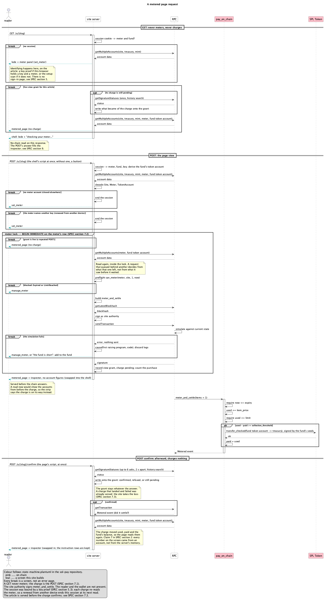

# Newsprint — specification

The sol-pay demonstrator site.

Status: **draft for the fund design, begun 2026-10-01.** [sol-pay][solpay]
0.2.0 replaced the delegate design with a fund, a meter per site per fund,
and a browser key the meter names. This document specifies Newsprint on that
design. The implementation still follows the delegate design until the work
this document describes lands. The delegate-design specification, and the
site built to it, are at the git tag `Progress_1.1.1`. Decisions here carry
the date they were made. Where a decision has been proposed and not yet
ratified, §14 lists it.

[solpay]: https://github.com/wbreeze/sol-pay

Where this document and `wasm-client/SPEC.md` disagree about the library,
that document is right and this one is a bug. Where this document and the
state diagram at the sol-pay repository root disagree about the flow, the
diagram is right.

## 1. What this is

**Newsprint** is a working site that meters a small set of articles with
sol-pay. Anyone interested runs their own copy against devnet, with a mint it
issues on first run (§12.0). One hosted instance also exists, for trying real
wallets and for a link to share (§12.6). It is a demonstration, operated as
one.

The name is what a newspaper was made of, and what reading one used to be
like. You bought a paper, and nobody knew which parts of it you read: not the
newsagent, not the publisher, not an advertiser. Which pages you lingered on
was between you and the page. Nobody designed that property; it was a
property of paper, and every digital replacement has quietly removed it. This
site is the argument that it can be paid for instead, and kept. So the name
carries the thesis, which is §10.2's, and the thesis is not a claim about
price.

The site exists because the sol-pay client library deliberately ships no
application. `wasm-client/SPEC.md` names the screens a site builds —
`set_meter`, `manage_meter`, `metered_page` — and says they are the
integrator's. Until someone builds them, every claim the library makes about
being integrable is untested, and the first integrator pays to discover what
the library forgot.

So this is two things at once, and the second is the one that constrains the
design:

1. **A demonstration.** Someone evaluating sol-pay reads an article, watches
   the meter move, and sees the transfer land on the explorer.
2. **The reference integration.** Someone who has decided to adopt sol-pay
   reads this repository to find out what they have to write. Every part the
   library does not supply appears here in one place, in the smallest honest
   form: remote procedure calls to a node (RPC), the Solana Pay transaction
   request, the browser key and its proof, the session, the viewer-to-meter
   map, the decision to meter, error attribution, and log hygiene.

The second purpose is why the machinery is visible (§9) rather than hidden. A
demo that conceals the plumbing proves the reading experience is unobtrusive
and teaches nothing. This one shows both halves at once.

### What it is not

Not a product, not a template to fork into production, and not a content
management system (CMS). It runs on devnet with a token that is worth
nothing. It holds signing keys on a web server, which is defensible only
because those keys control nothing of value. It hands out its token from a
form (§4.3), which no real site would do. All three facts are stated on the
site itself, not only here.

## 2. What the demo has to prove

The list is short, and every item is falsifiable. If the finished demo cannot
do one of these, it has failed, whatever else it does.

| # | Claim | Where it is proven |
| --- | --- | --- |
| 1 | A reader with no relationship to the site can start paying in one wallet gesture | `set_meter`: one scan, one transaction, one signature (§6.3) |
| 2 | Reading afterwards costs no wallet interaction at all | The browser key answers for the reader (§5); the wallet is not involved again until a renewal |
| 3 | The site charges only when a charge is worth making | The settle fires at the collection threshold, not on every view (§4.2) |
| 4 | The reader's exposure is bounded by numbers the reader chose | The limit and the expiry stop metering on chain, the fund's balance caps what any site can take, and the demo shows each block |
| 5 | Reaching the limit or the expiry is an ordinary screen, not an error | `manage_meter` offers renewal or closing the meter |
| 6 | Leaving costs nothing | Closing the meter takes it off the chain, and it is then gone from the chain — in the inspector, and on any explorer |
| 7 | Every number on the screen came from an account, not from the server's memory | The inspector shows the decode beside the render |

Claim 4 is `wasm-client/SPEC.md` §4.7's sentence, and it is worth repeating
because the design has to keep it true: *a site can take at most its meter's
limit before its expiry; a browser can take nothing; the program can take at
most the fund's balance; the reader sets all three.*

Claim 6 is about the meter, not the fund. Closing a meter ends this site's
claim on the reader's money. The money itself stays in the reader's fund,
where other sites may still be drawing on it, and taking it back out is the
reader's business through a wallet (§11). The site says so at the close
rather than implying that leaving returns the deposit.

Claim 7 makes the other six credible. A demo that reports its own state
proves nothing; this one reports what it read.

## 3. Shape

Four parties. The split follows `wasm-client/SPEC.md` §3, with the wallet
moved out of the page by the fund design.

**The page.** Holds the browser key, an Ed25519 key it generated for this site
on this device (§5). Signs two things with it: key proofs, and the close of its meter.
Holds no wallet, and loads no Solana library: WebCrypto signs, and the server
compiles every message the key signs (§12.2).

**The wallet.** The reader's own, on whatever device it lives. It signs one
transaction per site per device: the setup that opens or renews a meter. It
fetches that transaction from this site's server by a Solana Pay scan or tap
(§6.3). It never talks to the page.

**The server.** Holds the site authority. Composes the setup transaction the
wallet fetches, verifies key proofs, decides whether a request is metered,
signs `meter_and_settle`, and pays the fee for every close the browser key signs. Reads accounts
over RPC, decodes them, and runs preflight, using `wbreeze/sol-pay-client`
from Packagist, since §12.1 decided PHP. Never sees the reader's wallet key or
the browser key's private half.

**First-run setup.** Creates the demo mint and the treasury, calls
`initialize_site` once, and records the resulting addresses. It is a command,
`bin/setup`, and no web request runs it (§12.0). Setup runs before a site
authority exists, because generating one is the first thing it does, and it
refuses once the site is provisioned. The operator never handles a keypair.

The article text is static content in the repository. There is no database
of articles and no editor.

## 4. Chain setup

### 4.1 The mint

The demo issues its own SPL mint, **DEMO**, with six decimals. Six because
USDC has six, so an integrator reading this repository meets the same
arithmetic they will meet in production rather than a simplified version.

Its mint authority is the faucet key (§4.4). Nothing else can mint DEMO, and
DEMO buys nothing. The site says so.

Devnet USDC was considered and rejected on 2026-09-02. It makes the amounts
read realistically, but it puts the demo's ability to fund a visitor behind
a faucet nobody here operates. A demo that cannot fund its own visitor is not
a demo.

### 4.2 Site parameters

`initialize_site` takes three amounts. These are the demo's, in base units,
with the DEMO figure beside them:

| parameter | base units | DEMO | in views |
| --- | --- | --- | --- |
| `item_price` | 10_000 | 0.01 | 1 |
| `collection_threshold` | 100_000 | 0.10 | 10 |
| `min_limit` | 500_000 | 0.50 | 50 |

The program requires `item_price > 0` and `min_limit > collection_threshold`.
The sol-pay README asks for a minimum limit of forty or fifty times the item
price, which is where fifty views comes from. One item here is one article
view.

**The item price is a demo figure, not a recommended price.** It was chosen so
a reader reaches the collection threshold in ten views, not from any analysis
of what an article is worth. Every venture that has actually sold single
articles landed between 10¢ and 40¢, and the break-even arithmetic against
news advertising revenue agrees with them. Nothing in the program constrains
the price, so a real deployment's price is its own decision.

What the reader experiences follows from the three numbers, and is the
reason they were chosen: a settle on the tenth view, and the limit on the
fifty-first. Both are reachable inside one sitting. Fifty articles is more
clicking than a visitor will do, so §7.4 lets them skip ahead without lying
about it.

These are the values `Progress_1.1.1` initialized on devnet. The upgrade to
the fund design kept the `Site` account's layout, and `bin/fund-trials site`
confirmed on 2026-09-30 that the 0.2.0 client library decodes the existing
account and that it agrees with `config/site.php`.

### 4.3 The faucet, for the demo only

**No implementation would ship this.** It exists because a demonstration on
devnet has no exchange to buy from, and it stands in for exactly that step.

On mainnet a reader buys USDC into a wallet first, somewhere other than the
site, along with a little SOL for fees and rent. The site's setup then creates
a fund and moves coin into it. The faucet is Newsprint's stand-in for the
buying, and it is kept separate from setup so that setup stays the same
transaction it would be on mainnet. Decided 2026-10-01.

**The reader pastes a wallet address into a form**, the way they would give an
address to an exchange, or to the public devnet faucet. The site sends to it:

- **SOL** from the faucet key, for the rent and fees the reader's wallet pays
  at setup;
- **DEMO**, minted to the address's associated token account, which the same
  transaction creates if it is missing.

The page never learns the wallet otherwise (§5), so the form is the only place
the site is told an address on purpose, and the privacy page lists it (§10.2).

**The amounts.** The DEMO grant is 0.60: a little over one minimum limit and
well under two. That stinginess is deliberate. A reader who opens at the
minimum, reads to the limit, renews and keeps going runs the *fund* short
three clicks into the second period, which is §13.2's walkthrough and the only
way to reach a settle refused for want of money. A generous faucet would make
that state unreachable.

The SOL grant is 0.01. Measured on devnet on 2026-09-30, the reader's first
setup costs 0.003886 SOL in all: rent of 0.001046 for the fund, 0.001488 for
its token account and 0.001346 for the meter, plus a 0.000005 fee. Each later
renewal, deposit or wallet-signed close costs a fee alone, and closing returns
the rent. So 0.01 covers a first setup, a second fund or a second device's
setup, and hundreds of fees besides. The grant under the delegate design was
0.05, about thirteen times a setup. At 0.01, the faucet key's reserve of
0.25 SOL funds about twenty readers rather than about five. Decided
2026-10-01.

**Nothing is behind a click.** Before the reader submits the form, the screen
says which address will receive what, that it is once per address, that none
of it is worth anything, and that the faucet exists for the demo and is not
something a real site would offer. A single button sends it.

**One grant per address**, recorded in the faucet ledger, and a rate limit per
source IP address: five sends a day, counted whether or not the send lands.
The ledger is the host's and does not travel. A replacement host that reuses
the site's keys (§12.6) starts with an empty ledger, so an address may draw
once more there. Accepted, 2026-10-05: the limit keeps the faucet key solvent,
and a new host is rare.
The limit keeps a keyed hash of the IP address for that day and never the
address itself (§10.4). The faucet is the only part of this demo
with an abuse surface worth naming, because it is the only part that gives
anything away. What it gives away is worthless, so the limit exists to keep
the faucet key solvent, not to protect an asset.

### 4.4 Keys the server holds

Two:

- the **site authority**, which signs `meter_and_settle` and is what
  `has_one = authority` checks. It also pays the fee for every close of a meter,
  because the browser key that signs `close_meter` holds no SOL (§5.4).
- the **faucet key**, which holds SOL to distribute and is the mint authority
  over DEMO.

Separating them costs nothing and is what a real deployment would do. Neither
is in the repository. Both are devnet keys controlling nothing of value, and
the site says so rather than implying a security posture it does not have.
What custody a real deployment owes the authority key is §15.

The hosted instance (§12.6) has its own site, with its own authority, mint and
faucet key. Decided 2026-10-01: an environment that shares a key with another
shares its compromise too (§15.2).

**The hosted instance's keys are made on the development machine and copied
to the host**, decided 2026-10-05. They stay in `var/hosted/` there, untracked.
A replacement host takes the same keys, so that replacing the machine strands
nobody's meter. New keys are a separate and deliberate act, the roll of
§12.6. The keys are files on the host because they are devnet keys, short
lived, controlling play money, and §15.3 says what a deployment would do
instead.

### 4.5 Funding the server

Both keys spend SOL, and on devnet nothing replenishes them unless someone
does. This section says who pays what and how the site stays funded.

**Who pays what.** Measured on devnet, 2026-09-30:

| action | paid by | cost |
| --- | --- | --- |
| first setup: fund, its token account, meter | the reader's wallet | 0.003886 SOL (rent 0.003881, returned on close; fee 0.000005) |
| renewal, or a deposit alone | the reader's wallet | 0.000005 SOL fee |
| `meter_and_settle`, settling or not | the site authority | 0.000005 SOL fee |
| closing the meter, `close_meter` signed by the browser key | the site authority | 0.000010 SOL (two signatures: the authority's and the key's) |
| a faucet grant | the faucet key | the grant, plus the reader's token account rent (0.001488) when it is new, plus a fee |

**The reader pays the rent, and sol-pay decides that.** `open_fund` and
`open_meter` create their accounts with the reader as payer, so a site cannot
pay a reader's rent without a change to the program. It matters less than it
looks. The rent is a deposit, not a fee: the program returns the meter's rent
to the reader at the close and the fund's at `close_fund`, whoever signs. A
site that paid it would be making the reader a gift. What the reader has to
hold is SOL for the moment of setup, which is what §4.3's grant is for.

**How much.** The authority's cost is a fee per page view that charges, plus
two per close. At 0.000005 SOL, a tenth of a SOL meters twenty thousand
views. The faucet key's cost is dominated by the SOL grant, which is why §4.3's
figure matters.

**How, on devnet.** First-run setup asks the public endpoint for an airdrop to
the authority, then moves a reserve to the faucet key (§12.0). The endpoint's
faucet refuses more often than it works and does not say why. The other routes
are the web faucet at faucet.solana.com and a transfer from any funded devnet
wallet. `bin/devnet-smoke` prints the address and these routes when the
authority is empty. A roll (§12.6) asks nobody: the old authority and the old
faucet key send what they hold to the new authority.

**Knowing before it runs out.** `bin/devnet-canary` already exits 1 when the
faucet key can no longer fund a visitor. It gains the same check for the
authority: enough for a configured number of charging views and closes.
`GET /health` reports both. A demonstration that fails because a key ran
dry looks broken, not poor, so the warning belongs where the operator already
looks. Decided 2026-10-01: good enough for a demonstration.

**How, anywhere real.** Out of scope beyond one sentence: fee payment is one of
the roles §15.2 says a deployment may hold apart from the authority.

## 5. Identity: the browser key

The library verifies a key proof and leaves the rest of identity to the site
(`wasm-client/SPEC.md` §6.6). This section is the rest. Everything here is
implemented in this repository and nowhere upstream.

What the site needs to know about a reader is narrow: *is the browser in front
of it the one a meter names?* Not who the reader is, and not which wallet they
hold. The meter answers the question itself, because it names a public key,
and only the browser holding the private half can sign for it.

### 5.1 The key

The page generates an **Ed25519 key with WebCrypto, non-extractable**, and
keeps the `CryptoKey` in IndexedDB. One key per site per device. This is
`wasm-client/SPEC.md` §4.8's recommendation, and the reasons carry over
unchanged. A non-extractable key can sign but cannot be read out, so a script
that gets into the page can use it while the page is open and cannot carry it
away. Solana signatures are plain Ed25519 over the message bytes, so the same
key signs a `close_meter` with no wallet code in the page.

The public key, base58-encoded, is what the server names in `open_meter` or
`renew_meter`. Beside the key the page stores the meter's address once the
server tells it, so that a returning browser can say which meter it holds
(§5.3). Neither is secret.

**JavaScript is required to identify.** WebCrypto has no form-based fallback.
A reader without JavaScript can read every lede, and the site says why the
meter needs a script. Once identified, a session reads and pays without
further script, because §7.1's charging form works as a plain form.

### 5.2 The proof

The protocol is the site's own. The library supplies only `Proof::verifyKey`,
which answers whether a signature is valid and nothing else.

1. **The server issues a nonce:** 32 random bytes, stored in SQLite (§12.5)
   with the time it was issued.
2. **The page signs** the bytes `Newsprint key proof\n`, then the site's
   origin, then the nonce. The prefix and origin are there so that a proof is
   never also a valid message of any other kind, here or at another site.
3. **The server checks**, in this order, and refuses on the first failure:
   - the nonce is one it issued, not more than five minutes ago. It forgets
     the nonce at this first presentation, whether the proof then passes or
     not;
   - the signature is valid for the key the meter names
     (`Proof::verifyKey`, with the meter fetched from the chain);
   - the meter's `site` is this site.

**An expired meter still binds**, decided 2026-10-01. A session on an
expired meter can charge nothing. Every charge checks the expiry before it
is sent (§7.3), and the program refuses `Expired` besides. What the session
can do is open `manage_meter` and close the meter, as §5.5 promises.
Refusing the proof would leave a reader whose session ended with the browser
no way to close an expired meter.

A proof accepted twice can be replayed by whoever copies it, and each article
the replayer reads is charged to the reader's fund. Only the site's nonce store
can refuse the replay, which is why the nonce is forgotten at first use rather
than at expiry. The five minutes is the time a page needs to sign and answer.
It bounds something different from the meter's expiry, which is hours or days.

### 5.3 The session: the viewer-to-meter map

The integrator's one obligation under the fund design is to remember which
meter a browser uses (`wasm-client/SPEC.md` §4). Here that is a session
cookie and a row: the session id, the meter's address, its fund's address,
and the key that was proven. The fund's address saves a read: the meter names
its fund, and the charge needs the fund's token account in the same call. The cookie carries the id and nothing else, `HttpOnly`,
`SameSite=Lax`, `Secure`, with no persistent "remember me".

A session is bound by a proof in three places:

- at the end of setup, when the reader presses *continue* (§6.3);
- when a browser that holds a key and a meter address arrives with no session.
  The page sends both with a proof, and the server binds a new session
  without the wallet;
- after a renewal from this device, which names the same meter.

**The chain ends sessions, not a timer alone.** The metering path reads the
meter on every charge anyway (§7). Each read also checks that the meter still
names the session's key. An expired meter blocks the charge and keeps the
session, so that the meter can still be closed (§5.2). When another device
renews the meter to its own key, this device's session ends at its next read,
with no message between the two devices. `bin/fund-trials renew` showed the
chain half on 2026-09-30: after a renewal, the old key's proof was refused and
the new key's accepted.

**Why the proof binds a session rather than every request.** Signing each
charge would need a fresh nonce per page view and a script on every read, and
it would add nothing the meter read does not already check. The proof
answers *is this the browser*; the read on every charge answers *is it still*.

A publisher with accounts would put the meter address on the account row
instead of a session, and nothing else here would change.

### 5.4 Closing the meter

The reader leaves by closing the meter. The page sends `close_meter`, signed
by the browser key. The key holds no SOL, so the site authority pays the fee,
and the meter's rent returns to the reader. Closing forgives whatever is
unpaid, which is always below the collection threshold. A close carrying a
transfer could fail and leave the reader unable to leave, so the program
declines to try.

1. The page asks the server to prepare the close. The server compiles the
   message with `SolPay\Tx`: `close_meter`, the authority as fee payer, a
   recent blockhash. It keeps the message against the session and returns its
   bytes.
2. The page signs the bytes with the key.
3. The server checks the signature against the message it kept, adds the
   authority's signature, sends, and erases its record of the reader
   (§10.4).
4. The page deletes the key and the meter address from IndexedDB.

**The key signs bytes the server composed, and that is safe because of what
the key may do.** The program refuses the browser key as signer for every
instruction but `close_meter` (`wasm-client/SPEC.md` §4.8). A server that
handed the page a different message would get a signature the program does
not honour.

Measured on devnet, 2026-09-30: a close costs the site 0.000010 SOL, which
is two base fees for two signatures.

**Closing the meter is how a reader makes the site forget them**, decided
2026-10-01. The browser key is invisible to the reader. What the reader can see
is the meter, so closing it is the action a reader thinks of as "forget me",
and it is the one that does forget them (§10.4). The control is on the meter
panel and on `manage_meter`, at any time, labelled for what it does: *close
this meter*. There is no separate control that drops the session and keeps
the meter. The key would stay in IndexedDB, and the next visit would bind a
new session from it (§5.3).

The exposure on a machine the reader does not own is taught where it is
decided: in the expiry choice at setup (§6.3), not in a control the reader
would have to remember to use.

### 5.5 Walking away

Most readers will not close anything. They will close the tab, or the
browser, and not come back. This is what happens then.

**At the site, nothing waits on the reader.** The session ends when the
browser ends it or when its time runs out, and the sweep removes the row
within five minutes. Grants go within thirty-five minutes (§10.4). No charge
is ever made without a request from the reader's browser, so nothing is
charged while they are away. That is this site's policy, not the program's:
the program would let the authority meter up to the limit at any time before
the expiry, and §2's claim 4 is the bound the reader relies on.

**On chain, the meter stays open until someone closes it.**

- **Before its expiry**, a return to the same browser binds a new session from
  the key (§5.3), and reading continues where it stopped.
- **After its expiry**, nothing can meter it. The unpaid residue, which is
  below the threshold, is never collected. The meter still holds the reader's
  rent, 0.001346 SOL, and the fund counts it as open, so the reader cannot
  close that fund until the meter is closed (`FundHasMeters`).

**Three ways to end it, none needing the abandoned browser's cooperation
except the first:**

1. **The key**, if the reader returns to that browser. The panel offers the
   close, whether the meter has expired or not.
2. **A renewal from another device**, choosing the same fund. The new device
   takes the meter over (§6.4), and the old key is dead.
3. **The reader's wallet, from anywhere.** The program accepts the reader as
   signer of `close_meter`. The panel on an article, with no session, offers
   *close a meter with your wallet*: it asks for the fund index and shows a
   scan, the same way setup does (§6.3). The server composes `close_meter`
   signed by the reader, who pays the fee, and refuses if that fund has no
   meter here. Proposed (§14).

**Why the expiry matters as much as the limit.** Walking away is the common
case, and the expiry is what bounds it. A meter left on a machine the reader
does not own is safe once its expiry passes, whatever happens to the machine.
That is why the panel offers short expiries plainly (§6.3).

### 5.6 Where identity shows

**There is no sign-in screen.** Identifying happens inside the meter panel on
the article. sol-pay's own state diagram has no sign-in node: `identified` is
a choice, and "not identified" goes straight to `set_meter`. A page whose
only purpose is to collect an identity reads as identifying for tracking,
which is what §10 disputes. Putting the identification where the money is
about to move is what keeps its narrowness visible.

**Identity is shown on the meter, not in the masthead.** A name and a way out,
repeated on every screen, is the furniture of an account. It invites a reader
to assume the account has contents — a profile, a history, preferences — when
what exists is a cookie, a row naming one meter, and a meter on a public
chain. The meter panel shows the meter's short name (§9) and the control that
closes it.

The words follow from that. The screens do not say "signed in" or "signed
out". They say this browser holds a meter for this site, and *close this
meter* ends it.

## 6. The reader's path

Six screens. Three are the cyan nodes of sol-pay's state diagram. The other
three exist because a demonstration needs a front door, a faucet and a
privacy statement.

| screen | reached when | the wallet signs |
| --- | --- | --- |
| index | always public | — |
| faucet | from `set_meter`, or directly | — (the faucet key sends) |
| `set_meter` | in the panel on a metered article, with no session | the setup transaction, by a scan |
| `metered_page` | a session whose meter passes preflight | — |
| `manage_meter` | the limit or the expiry is reached, or navigated to at any time | a renewal, by a scan; closing the meter needs no wallet |
| privacy | always public | — |

**`manage_meter` is reachable at any time**, decided 2026-09-02. The state
diagram draws the metered path and does not enumerate the site's navigation.
A reader who has let a site draw on their fund may reasonably expect to find,
at any moment, a page that says what they have spent and offers a way out.

### 6.1 Index and teasers

The index lists the articles. Each article page is two parts: a **lede** that
is public and unmetered, and a **body** that is not. The lede gives the server
something honest to render to a reader with no meter, so `set_meter` appears
beside real content instead of as a wall. It also makes §2's claim 2 — *reading
costs no wallet interaction* — observable: the reader sees the same page
twice, once truncated and once whole.

The index runs **newest first** by each piece's `created` date (§10.1), with
the slug breaking a tie and an undated piece last. `revised` is deliberately
not the key, so that fixing a typo in an old piece does not carry it back to
the top. Decided 2026-09-12.

Each article links **the piece before and after it, chronologically**, and
*previous* is the older one. The links come after whatever the page is for:
under the body for a reader who has paid, under the meter for one who has not.
That puts them in the same place in both states, so a meter is the only thing
that changes between the two renderings. The waiting shell (§7.1) carries
none, since it is on screen for the second or two a charge is in flight.

The article's head is the title, then the lede, then the reading time and
price, in the order the index uses. The lede is set in a different family from
the body, as a newspaper deck is.

### 6.2 A metered request, end to end

The source is `metered-request.plantuml` at the repository root, rendered with
`plantuml -tpng`, on the convention of `state-machine.plantuml` in sol-pay:
pink is on chain, teal is a screen this site builds. **It is redrawn for the
fund design**: the meter is found through the session (§5.3), the key proof
binds the session, and the setup scan replaces the wallet in the page.
Rendering it is the author's.

Every branch that leaves the diagram early is a screen, not an error page.
That is §2's claim 5.

### 6.3 The wallet gesture

The reader's wallet signs one transaction per site per device: the setup. It
fetches it from this server through a **Solana Pay transaction request**.
`wasm-client/SPEC.md` §4.9 sets out why, and the short form is that the three
barriers to reach the delegate design carried all sat on a wallet in the page.

**The steps.**

1. **The panel asks** for a limit, an expiry, a deposit and a fund index
   (§6.4). It states the price per article, the minimum limit, and what the
   reader's wallet will pay in rent and fees, before anything is signed. The
   expiry is a choice among a few, never a date to type, each with a line of
   guidance, decided 2026-10-01:
   - *an hour*: for a machine the reader does not own. After the hour, the
     key left in that browser opens nothing;
   - *a day*, the default: one sitting, with room to come back;
   - *a week*: the reader's own device;
   - *thirty days*: the reader's own device, read often. The panel says that
     until then, anyone who uses this browser can read on this meter.
2. **The page makes its key** if it has none (§5.1), and posts the key and
   the four answers. The server records a **pending setup**: a random id, the
   key and the answers. It lives ten minutes. It belongs to the key rather
   than to a session: a browser that sets up has no session yet, and
   *continue* proves the key, which is what the setup names.
   A renewal or a deposit started from `manage_meter` also records the fund
   of the session that started it, so that the wallet cannot be another
   reader's.
3. **The page shows the link** `solana:https://<site>/pay/<id>`, as a link to
   tap on a phone and as a QR code to scan from a desktop. The QR code is
   rendered by the server as inline SVG (§12.2).
4. **The wallet fetches it.** `GET /pay/<id>` answers with a label and an
   icon, both served by this site (§10.3). `POST /pay/<id>` carries the
   wallet's `account`. The server records the account on the pending setup,
   composes the transaction (below), and returns it, unsigned, with the
   account as fee payer, as the Solana Pay specification requires. The wallet
   shows it, the reader signs, and the wallet submits.
5. **The reader presses *continue*.** The page asks for a nonce, signs it
   with its key (§5.2) and posts the signature. The server derives the meter
   from the recorded account and the fund index, reads it once, and checks
   that it names the pending key. It then checks the proof (§5.2), binds the
   session (§5.3), tells the page the meter's address, and erases the pending
   setup. If the meter is not there yet, the page says so and offers the same
   control again.

**Nothing polls.** The wallet tells the page nothing, so the reader's own
gesture is what asks whether the meter exists: one read, on a click. On a
phone the return from the wallet app is already that gesture; at a desk the
reader was always going to turn back from the phone. This is
`wasm-client/SPEC.md` §4.9's rule, and it holds throughout this site.

**What the server composes.** It reads, in one call, the fund that the
account and the index derive, this site's meter on that fund, and the
reader's own token account. Then:

- **no fund:** `open_fund` at the index, which must come before the deposit,
  since the fund's token account has to exist first;
- **a deposit of more than zero:** the transfer from the reader's token
  account into the fund;
- **no meter:** `open_meter`, naming the pending key, limit and expiry;
- **a meter:** `renew_meter` with the same three, which is how a second device
  takes the meter over (§6.4).

`bin/fund-trials` composed each of these on devnet on 2026-09-30, and each
confirmed.

**What the server refuses to compose.** These are checked before the wallet
sees anything, because a transaction that fails the wallet's own simulation
is a worse screen than a refusal:

- **a deposit the wallet cannot cover.** The server knows the wallet when it
  composes, so it reads the balance. Devnet taught this twice on 2026-09-30:
  SPL Token refused the deposit with `InsufficientFunds`, and the wallet would
  have shown the failure as its own;
- **a limit below `limit_floor`, or an expiry in the past.** The program
  would refuse both, with `LimitBelowMinimum`, `LimitBelowUsage` or
  `ExpiryInPast`;
- **`open_fund` on an index in use.** The composition rules above never
  produce it. `bin/fund-trials wrong` sent it anyway, and the System program
  refused it as an account already in use.

A refusal is an error response with a sentence and no transaction. How
wallets show such a response is untested until a real wallet scans the link,
which waits for the hosted instance (§13.4).

**The pending setup holds the wallet's address for at most ten minutes**, and
§10.4 lists it. Once *continue* succeeds, the session holds the meter's and
the fund's addresses, and not the wallet's.

### 6.4 Which fund

A reader may hold several funds in one mint, each at its own index from 0 to
255 (`wasm-client/SPEC.md` §4.7). Which fund a transaction draws on is the
reader's choice. The server never makes it for them (`wasm-client/SPEC.md`
§4.9).

**The panel asks because nothing else can answer at the moment of choosing.**
The page does not know the wallet until the wallet fetches the transaction.
By then the panel has already drawn the link, with the index in it. A list of
the reader's funds, however quickly fetched, would arrive after the choice it
was meant to inform.

**The site does not list a reader's funds, even where it knows the wallet.** A
fund records its reader and its mint, so one `getProgramAccounts` call,
filtered on those two fields, would return all of a reader's funds in a mint
with their indexes. This site avoids that call because managed RPC providers
throttle it, charge for it, or switch it off (`wasm-client/SPEC.md` §4.7). A
reference integration should not lean on a call that a production site may
not be allowed to make. The alternative that avoids the call, deriving all 256
fund addresses and fetching them, took 2.6 s on 2026-09-30. Listing belongs to
the management page that `wasm-client/SPEC.md` §4.10 sets aside.

So **the panel asks**, and says what the answer means in one sentence: a fund
is a pocket of DEMO in the reader's wallet that sites draw from, and most
readers need one. The first-visit default is fund 0, stated on the screen
rather than left implicit. A reader who wants another types the number.

Three situations follow from the composition rules in §6.3, and the panel
covers each with the same scan:

- **First visit, fund 0 absent:** open the fund, deposit, open the meter.
- **A second device, same fund:** the meter exists, so the transaction renews
  it to the new device's key, with no deposit unless one is asked for. The
  old device's session ends at its next read (§5.3). Renewing to a new key
  costs the reader a fee only.
- **A second fund, same site:** a different index opens a second fund and a
  second meter. The site sees two meters from what it cannot tell is one
  reader. That is the arrangement `wasm-client/SPEC.md` §4.8 recommends for
  reading on two devices at once.

**Adding money without renewing is its own scan**, decided 2026-10-01 as an
important convenience. Through the setup route, a top-up would always renew,
because the composition ends with `open_meter` or `renew_meter`. A renewal
resets `used` and `paid`, moves the expiry and needs a limit at or above the
floor. A deposit alone is a valid transaction and touches no meter. So
`manage_meter`, and §8.2's short-fund screen, offer *add to the fund*: the
same pending setup and the same route, composing the transfer and nothing
else.

**After a renewal or a deposit, *continue* returns the reader to the article
they came from**, decided 2026-10-02. A reader reaches `manage_meter` from an
article that would not charge, and the article is where they were going. The
page keeps that article's path for the tab, in `sessionStorage`, and only when
the reader arrived from one of this site's own articles. The server is not
told, and nothing else can be made a destination. A reader who came to
`manage_meter` any other way stays on it.

### 6.5 Mobile

Mobile needs no path of its own under the fund design. The page holds no
wallet, so the Mobile Wallet Adapter, wallets' in-app browsers and the iOS gap
that shaped the delegate design do not arise. On a phone, the setup link opens
the wallet app. At a desk, the reader scans the QR code with the phone.
Either way, the reader comes back to the page and presses *continue*.

What remains is HTTPS. The wallet fetches the transaction itself, from
whatever network the phone is on, so the server must be reachable at a public
HTTPS address. That is why the hosted instance exists (§12.6), and why
running locally uses the development wallet instead (§12.6).

## 7. The metering decision

This is the section an integrator comes here for. The library says preflight
"reports whether a charge would succeed, not whether it should happen. Only
the site knows that." Everything below is this site knowing it, and every rule
here is the demo's policy rather than sol-pay's.

### 7.1 One charge per article, not per request

A request is not a page view. A refresh is a request. So are a back button, a
browser prefetch, a bot, a double-submitted form, and the inspector re-reading
its own panel. Metering each of them charges a reader several times for one
article. It is the defect most likely to be shipped by an integrator who wires
`meter_and_settle` straight into a route handler.

So the demo issues a **view grant**: on a successful charge, the server
records the meter, the article and an expiry thirty minutes out. A request
that finds a live grant is served without touching the chain.

**Thirty minutes is policy, settled.** It says a reader who paid for an
article may finish it, follow a link away, and come back. A publisher who
wanted grants per session or per day would change one constant. Someone will
ask for "pay once, keep it forever", and the answer is the reason a window
exists: **a permanent entitlement requires permanent memory**, and permanent
memory of what a reader read is what §10.4 is built to avoid. The window is
not protection either. Anyone can copy what they have paid for. A grant is a
rental window, not DRM.

**The page view is a POST, and a GET never meters**, decided 2026-09-11. A GET
is what a browser makes on its own account — a prefetch, a prerender, a
restore from history, a link preview — and HTTP defines it as safe to repeat.
A charge is not. So `GET /a/{slug}` answers from a live grant or, for a reader
the site could charge, sends a *shell*: the lede and a form posting to the
same URL, rendered without a chain read so that it arrives at once. A small
script posts the form straight away and swaps the answer in. Without
JavaScript the form is a button, and the POST answers with the whole page.
The one speculative load that can still reach the POST is a prerendered page
running the script, so the script waits for `document.prerendering` to
clear. A cross-site page cannot spend a reader's money by posting here: the
session cookie is `SameSite=Lax`, which a browser does not send on a
cross-site POST, so such a request arrives without a session and nothing is
metered.

**The guards that hold this**: `PrerenderTest` drives a real prerender and
fails if the page charges before it is opened. `SessionCookieTest` pins
`SameSite=Lax`. `MeterMiddlewareTest` covers the server's refusal of a request
carrying `Sec-Purpose: prerender`. `RouteTest` asks the routing table itself
whether any GET route can reach a `Meter`.

### 7.2 One charge at a time per meter

Two requests on one session that both reach the metering step would build two
`meter_and_settle` instructions from the same read. They do not conflict on
chain, because the program increments whatever it finds. So both succeed, and
the reader is charged twice for a race they did not cause.

The server therefore serializes the read, preflight, charge and grant **per
meter address**, with a transaction on the meter's row in SQLite (§12.5). The
lock and the state it guards are one object. The grant check happens inside
the lock, never in front of it: a check in front is this defect exactly,
because both requests read "no grant" before either waits. A request that
queued behind another finds the grant the first recorded and does not charge.

**Any deployment running more than one instance needs a lock that spans
them.** One SQLite file is one machine's answer.

`tests/Metering/OneMeterAtATimeTest.php` holds the server half. Four PHP
processes enter together on one meter, one article and one SQLite file.
Exactly one does the work, and the same four with the lock removed must
double-charge, which keeps the test honest. `bin/two-readers` makes the
chain-half observation by hand: two overlapping requests through the whole
stack, judged by the meter's own `used` rather than by anything the site
reports. Both move from wallet to meter address with the redesign.

### 7.3 Order: meter, record, render, then confirm

The server sends the charge and serves the article as soon as the RPC
endpoint has **accepted** it, decided 2026-09-17. Acceptance is not nothing.
The site does not pass `skipPreflight`, so the endpoint simulates first, and a
charge the program or SPL Token would refuse against current state is refused
there. Nothing is served, nothing is recorded, and the reader gets §8's
screen. A short fund, a spent limit and an expired meter are all caught
there.

The grant is recorded **pending** before the body is rendered, so a render
failure still leaves the reader holding what they paid for. The page's
follow-up, `POST /a/{slug}/confirm`, asks the cluster whether the charge
landed. A reader without JavaScript gets the same answer from
`GET /a/{slug}`, which asks once and does not wait. The answer is written onto
the grant once:

- **Landed:** `confirmed`. The follow-up also reads the charge's event, so the
  strip's "this one settled" comes from the chain.
- **Landed and failed:** `refused`. The accounts moved between simulation and
  inclusion: a withdrawal from the fund in that second, or another site's
  settle draining it. **The grant stays.** Taking the article back after the
  fact is the mysterious experience this order exists to avoid. The site
  loses one item price and a fee.
- **Never seen, and the blockhash has expired:** `unknown`, after
  `charge_settle_s`, asked with history search so that "not found" means what
  it says. The grant stays.
- **No answer yet:** still `pending`. Nothing is decided on a maybe.

**How it asks: up to six times, two seconds apart** (`confirm_attempts`,
`confirm_spacing_ms`). Of some sixty confirmations captured between 2026-09-09
and 2026-09-17, all but three answered on the first ask and those three on the
second. `Submitter::confirm` serves every transaction the site waits on.

**While the charge is pending, the page shows no account figure.** A read
taken straight after the send returns the accounts from before it: numbers
from an account, and the wrong ones, which is §2's claim 7 failing without a
symptom. The strip says the charge is on its way, and the follow-up brings the
figures.

**Why serve first.** The two failure modes are not symmetric. Refusing to
serve risks charging a reader for nothing, which destroys trust in a payment
system. Serving risks giving away one article at the item price. The site
absorbs the cheaper error. An integrator who disagrees should disagree
explicitly rather than inherit this by accident.

**A test fault exists** because devnet produces none of the last three
outcomes on request. `NEWSPRINT_CHARGE_FAULT`, read only against a devnet
endpoint and shown in §9's deployment section while it is on:
`fail-after-serving` skips the simulation, so a charge the fund cannot cover
lands and fails; `never-land` signs against a blockhash nobody issued.

### 7.4 Advancing the meter on purpose

`meter_and_settle` takes an item count, and the demo exposes it: a control
that meters **seven** views in one instruction, so a reader can reach the
limit in a handful of clicks instead of fifty page loads.

**Seven, not ten.** Ten is the collection threshold, so a ten-view step would
settle on every click, and the reader would conclude that metering means a
transaction per charge. Seven is below the threshold, so the settle fires on
some clicks and not others. From a fresh meter at the minimum limit, on a fund
holding 0.50:

| click | `used` | unpaid before | settles? | `paid` after | fund after |
| --- | --- | --- | --- | --- | --- |
| 1 | 0.07 | 0.07 | no | 0.00 | 0.50 |
| 2 | 0.14 | 0.14 | **yes** | 0.14 | 0.36 |
| 3 | 0.21 | 0.07 | no | 0.14 | 0.36 |
| 4 | 0.28 | 0.14 | **yes** | 0.28 | 0.22 |
| 5 | 0.35 | 0.07 | no | 0.28 | 0.22 |
| 6 | 0.42 | 0.14 | **yes** | 0.42 | 0.08 |
| 7 | 0.49 | 0.07 | no | 0.42 | 0.08 |
| 8 | — | — | blocked: `LimitReached` | 0.42 | 0.08 |

The first two rows ran on devnet on 2026-09-30, twice, through
`bin/fund-trials meter 0 7`.

Three things fall out of the table that prose cannot do as well. The settle is
*intermittent*, which is the economic argument for a collection threshold. The
reader is blocked at 0.49 against a limit of 0.50, because preflight asks
whether `used + charge <= limit`, not whether any limit remains. And the
reader arrives at the limit carrying 0.07 unpaid: the residue that a renewal
carries forward as the new period's `used`, with `paid` reset to zero, and
that a close forgives.

It is labelled as a demo control and it charges honestly. Seven views is
seven views. The fund moves, and the transfer is real. It is the same
instruction the site would send had the reader read seven articles, which is
why it belongs in a demonstration of the API: the item count is in the
instruction because batching is expected. It also shows what the sol-pay
README says plainly, that the limit is trust, not pacing. A site can draw
straight to the limit whenever it likes, and here is a button that does it.

### 7.5 What the demo does not decide

`wasm-client/SPEC.md` §4.4 warns that keying access off "has a meter"
eventually charges a subscriber. The demo has no subscriptions, so it cannot
demonstrate the coexistence. The decision point is still in the code, as a
single function that answers "should this request be metered at all",
returning true for every article here. It exists so an integrator can see
where their entitlement check goes.

## 8. When the chain says no

### 8.1 Attribution

A failed transaction gives a numeric code, and the number alone does not say
whose it is: `LimitReached` is 6003 from the metering program,
`InsufficientFunds` is 1 from SPL Token. The server finds the raising program
in the transaction logs and hands it and the code to `Cause::of`, which
returns a program error, a token error, or an unknown with the program and the
code.

**The raiser is the first program to report failure.** The runtime writes a
`Program … failed` line for every frame the error passes through, innermost
first, each carrying the same code. A failure inside a cross-program
invocation (CPI) therefore names the callee first and the caller after.
Until 2026-10-01 the site took the last line, which named the caller.
`bin/fund-trials wrong` found it on devnet, and `tests/Chain/FailureTest.php`
holds the repair, including the case that matters most: a short fund inside
the settle's transfer.

Log handling is the part the sol-pay README asks integrators to think about.
**What a transaction names depends on which one it is.** A charge,
`meter_and_settle`, lists the site, the authority, the fund, the meter, the
fund's token account, the treasury, the mint and the token program. It does
not list the reader's wallet. The setup transaction does, because the wallet
signs it and pays for it. So does a close, because `close_meter` returns the
meter's rent to the wallet, which it names. And no transaction is far from the
wallet: a fund's address is derived from it, and the fund records it, one
account read away. The program's events carry the meter's `used`, `paid` and
`transferred`. None of it is secret, and all of it is on chain. But copying it
into an application log or an error tracker moves a reader's spending history
into systems that were never scoped to hold it. So the demo's log handling has one
rule, enforced in one place: **the parser returns a cause and a signature, and
drops everything else before it returns.** Raw logs never reach a log line, a
metric or a response body. The inspector shows the decoded cause and a link to
the explorer, where the reader can read their own logs.

### 8.2 The branches

The 0.2.0 program's errors, and SPL Token's, as this site meets them:

| code | cause | raised by | what the reader sees |
| --- | --- | --- | --- |
| 6003 | `LimitReached` | `meter_and_settle` | `manage_meter`: usage so far, renew or close the meter |
| 6007 | `Expired` | `meter_and_settle` | `manage_meter`: the meter's time is up; renew (an expired meter may be renewed) or close the meter |
| 1 (SPL) | `InsufficientFunds` | the transfer inside `meter_and_settle` | the fund is short: its balance and the amount due, and a scan to add to the fund (§6.4) |
| 6000 | `LimitBelowMinimum` | `open_meter`, `renew_meter` | never, when the panel enforces `limit_floor`; if it appears, the panel is wrong |
| 6004 | `LimitBelowUsage` | `renew_meter` | the same |
| 6008 | `ExpiryInPast` | `open_meter`, `renew_meter` | the same, for the expiry |
| 6006 | `MintMismatch` | `open_meter`, `renew_meter` | never through this site, because the fund's address is derived from this site's mint |
| 6009 | `Unauthorized` | `close_meter` | the key on this device is not the meter's: another device renewed it. The session ends (§5.3) |
| 6010, 6011 | `FundNotEmpty`, `FundHasMeters` | `close_fund` | never: closing a fund is the reader's business, through a wallet (§11) |
| 1 (SPL) | `InsufficientFunds` | the deposit, at setup | never, because the server refuses to compose it (§6.3) |
| — | unknown | anywhere | the program address and the code, and a link. No guess. |

**`InsufficientFunds` is no longer ambiguous.** Under the delegate design SPL
Token returned it both for a short balance and for a short allowance, and the
two needed opposite answers. The fund design has no allowance, so the code
means one thing: the fund holds less than the unpaid total. The answer is
money, and the screen says how much.

The settle and its increment are one instruction. A refused settle leaves
`used` and `paid` unchanged, so a failed charge is never a silent one.

### 8.3 What happened to "one delegate per token account"

Nothing is left of it, and one paragraph says why. Under the delegate design
every site wrote its permission into the same field of the reader's token
account, and SPL Token's `approve` replaced whatever was there. A reader
metered by two sites in one token silently broke the first. Under the fund
design each site's permission is its own meter, at an address derived from the
site and the fund, and the money is in an account the metering program
controls. Nothing one site's reader signs can overwrite another site's meter.

## 9. The inspector

A panel, present on every screen, collapsed by default and one click from any
page. Its job is §2's claim 7: *every number on the screen came from an
account, not from the server's memory.*

**The sections**, in order from what changes to what does not: *The values,
in full*; *Preflight, for this request*; *The last transaction*, on a request
that made one; *Your meter, on chain*; *Your fund, on chain*; *Your wallet*;
*Treasury*; *Site account, decoded*; *Deployment*. The meter and the fund are
two sections, decided 2026-10-02, because they are two accounts: the meter is
this site's count, and the fund is the reader's, which other sites may meter
on too. The three sections about the reader appear only where a session holds
a meter.
*Configuration drift* appears only when the chain and `config/site.php`
disagree, placed beside the account it disagrees with.

The panel was reduced for the redesign on 2026-10-01 and completed on
2026-10-04, when the close and the wallet's transactions gained their places
(§9.2).

### 9.1 Short names

Base58 is unreadable and, worse, comparable-looking: two addresses that share
four leading characters read as one address to an eye scanning a panel. So
every address the demo shows gets a short name: a role prefix plus a
syllable derived from a hash of the address. The same address always draws
the same name, for every reader and after a redeploy, which makes a name
something two people can say to each other on a call.

| prefix | what it names | provenance |
| --- | --- | --- |
| `PID` | the metering program | a deployed program |
| `SPDA` | the site account | derived by this program: `["site", AUTH]` |
| `FPDA` | the reader's fund | derived by this program: `["fund", RDR, MINT, index]` |
| `FATA` | the fund's token account | derived by the associated-token program |
| `MPDA` | this site's meter on that fund | derived by this program: `["meter", SPDA, FPDA]` |
| `BKEY` | this browser's key | generated in this browser (§5.1) |
| `RDR` | the reader's wallet, as the fund names it | the reader's own |
| `MINT` | the DEMO mint | a keypair first-run setup generated |
| `TRSY` | the site's treasury | derived by the associated-token program |
| `AUTH` | the site authority | a keypair first-run setup generated |
| `TKPG` | the token program | a fixed Solana address |
| `ACCT` | an address the panel cannot place | — |
| `DATA` | an instruction's bytes | — |

The panel's first section, *The values, in full*, defines each name once: the
short name, the full value with its explorer link and a copy button, and on
the line beneath, what the value is and then how it was derived. Every other
section writes the short name alone, linked to its row. A copy button never
yields a short name, and the panel says once that the names are this site's
invention, not anything a wallet or an explorer knows.

Rendering every address alike would be tidier and false. Three kinds are
told apart: derived by this program, derived by the associated-token program,
and never derived. The middle kind is the one that is easy to get wrong:
neither the treasury nor the fund's token account was simply created, and both
have seeds.

### 9.2 What the panel shows

**Decoded accounts.** `Site`, `Fund` and `Meter` field by field, with amounts
both in base units and in DEMO. Seeing the two side by side is what makes the
six-decimal scaling error `wasm-client/SPEC.md` warns about visible. The
fund's balance is its token account's, decoded beside it.

**Preflight, for this request.** The charge, `can_meter`, `will_settle`,
`items_remaining` and `limit_floor`, each with its value and the on-chain
check it mirrors.

**The last transaction.** "Last" means this request's: §10.4 leaves no record
of a reader's earlier transactions for the panel to reach back to. On a page
that made none, the section is absent. For a charge or a close, which the
server builds, the panel shows the instructions as the builders produced them:
program, accounts in order with signer and writable flags, and data as hex.

**A close is shown by the request that sent it**, decided 2026-10-04. That
request answers the page with the panel's sections, and the page puts them
where the old panel was. The read that the close already makes after it sends
(§5.4) asks for the site's accounts and the fund's in the same call, so the
panel costs the close no round trip. The panel then shows the accounts as the
close left them: the meter not found, and the fund with one meter fewer. One
request composes the close and the next sends it, and the compiled message is
all the site keeps between the two. So the instruction rows are read out of
the message that the browser key signed, and the section says that is their
source.

**Your wallet**, decided 2026-10-04. One row says which wallet the fund
names, and that the page was never told it (§5). The heading does not say *on
chain*, because the site reads nothing from the wallet's own account. A
setup, a renewal and a deposit are composed in the wallet's request and
submitted by the wallet (§6.3). A wallet transaction is therefore never *the
last transaction*: no request the site serves afterwards knows that one has
just gone. The browser knows, because the reader pressed *continue*. So the
page keeps one word for the tab, in `sessionStorage`, saying which of the
three the wallet sent. The panel on the page that follows adds a `sent` row
to *Your wallet*, and the word is deleted as it is read. The row's words are
the server's, carried in every panel in an inert `<template>` element. The
server is not told and stores nothing. The panel shows no signature for a
wallet's transaction, and that holds for the development wallet too (§12.6),
whose signature the server does see.

**The event is read when the panel is opened**, with one `getTransaction`,
because the panel is collapsed by default. **And the panel's own read is
deferred on any page that read nothing else**: on 2026-09-09, `/privacy` went
from 0.899 s to 0.002 s when it stopped reading the chain for a closed panel.
The rule is not *defer the panel*. It is **defer the read nobody else
needed**. Where the request already read the chain for its own reasons, the
panel renders from that read at no cost.

## 10. Content

### 10.1 The articles

Roughly twelve pieces, markdown in the repository, each with front matter for
title, slug, lede, reading time and dates. No external CMS, no fetch at
request time, no images beyond what the text needs.

**Who they are for**: an implementer, somebody metering their own content and
deciding whether to do what this site does. The test for a subject is whether
that person would be worse off not knowing it. The material is the development
sessions of sol-pay and of this site, edited into episodes: each piece is
about one decision, keeps the objection that changed the outcome, and drops
the rest. `notes/writing.md` carries the voice and the prose rules.

**Front matter.** `created` is required, the day a piece was written.
`revised` is optional and belongs only on a change a reader would notice. A
draft shows neither date. The title lives in the front matter and is rendered
by the template; `bin/build-content` refuses a body carrying an `<h1>`, so the
title cannot be written twice.

**The dates are the writer's claim, and git is the witness**, decided
2026-09-12. Only a person can tell a revision from a touch-up, so the dates
are not derived from history. `bin/content-dates` reads the commit that added
each file and the last that changed it, and fails when a published piece has
moved past the date it claims. A commit that changes nothing a reader sees
says so in a `Reader-Visible: no` trailer. CI runs it with `--require-git`
and full history, so a green result always checked something.

**Scrub before publishing.** Sessions carry local paths, usernames, key
material, half-formed opinions about third parties, and dead ends that read
as commitments. Every piece is read once with that list in hand before it
becomes content.

**What the redesign makes wrong, and what happens to each piece**, decided
2026-10-01:

- **Deleted:** `OneDelegate.md`, "The approval that quietly replaces another";
  `TheDelegate.md`, "The permission nobody shows you"; and `ThreePhantoms.md`,
  "Three wallets, one name, and a refusal that wasn't true". Each is about a
  mechanism the fund design removed.
- **Kept and made current:** `NoSignInPage.md`, "The ID of what's paying". Its
  subject, pseudonymous metering with no sign-in page, is still this site's.
- **Rewritten after the inspector is rebuilt:** `ReadingTheInspector.md`.
- **Revised to be current:** `TwoOrderings.md`, `TheLogs.md`,
  `WhatTheLimitPromises.md` and `FirstEverOnChain.md`, which mention contracts
  or approvals in passing.
- **Revised:** `privacy.md`, to follow §10.2 and §10.4.

### 10.2 The privacy page

The site carries a page at the URL a privacy policy would occupy. It is not a
privacy policy. It is the complete list of what the site holds, followed by the
argument that the list is short because of how the reader pays. It is served
at `/a/privacy`, with `/privacy` a permanent redirect to it, and it is linked
from the footer of every page.

**The argument, in three moves.**

1. *Here is everything.* Not categories, not "we may collect": the stores,
   enumerated, each traceable to a line in the code (§10.4). The list fits on
   a screen, and that it fits is the point.
2. *The list is short because the payment rail carries no identity.* An
   ad-funded publisher builds an identity graph because it has no way to
   charge a reader a cent. Metering supplies the other currency. The trade is
   explicit and not free: the reader pays money instead.
3. *The wallet is not a name.* The site does not know who the reader is, does
   not ask, and under the fund design does not even keep the wallet's
   address. It keeps a meter's and a fund's, and the fund's names the wallet
   to anyone who reads it (below).

**Move three has a caveat, and the caveat is what makes the page credible.**
A wallet address is pseudonymous, not anonymous. Addresses are linked to
people every day, by identity checks at an exchange, by reuse, by chain
analysis, by timing. And this site is not a neutral bystander. **A meter is a
public, permanent record that a fund paid this site, and the site caused it
to exist.** A meter names its fund. A fund's address is derived from the
reader's wallet, the mint and an index, and the fund names the wallet too. So
anyone holding a wallet address can find its funds, and from them every
site's meter that draws on them, with their limits, usage and payments in the
clear. The delegate design had the same exposure through its contracts. The
fund design moves it; it does not remove it. The page states it as a cost to
weigh, beside the benefit.

**Two more things the page discloses** under the fund design:

- **the faucet form** receives an address the reader typed, and the faucet
  ledger keeps it (§10.4);
- **the wallet talks to this site directly** when it fetches the setup
  transaction (§6.3), so the site sees the network address of the device the
  wallet runs on, as any web server sees its visitors. It is not logged
  against the wallet.

**What the page must not claim**: that a production site needs no privacy
policy; that the wallet is anonymous; that the reader cannot be correlated by
systems the site does not run; any legal conclusion at all. The page argues
from what the code does. Every claim on it is testable, and reviewing the page
against the code is a release checklist item.

### 10.3 No third-party requests

**The site loads nothing from a domain it does not control.** No analytics,
no tag manager, no CDN-hosted fonts or scripts, no embedded media. Fonts,
styles and scripts are served from the site's own origin. A font from a CDN
sends every reader's IP address and referring page to the CDN on every page
load, which would make §10.2's central claim false without anybody noticing.

Under the fund design the page loads no Solana library at all (§12.2), so the
rule is easier to keep than it was. Three consequences remain:

- **The inspector reads through the server**, never from the browser. A
  browser that called an RPC provider would hand it the reader's IP address
  beside the reader's meter.
- **The Solana Pay icon and label are served from this site**, because the
  wallet fetches them as part of the transaction request.
- **The wallet's own RPC is outside the site's control** and is disclosed
  rather than solved. A wallet submits through whatever endpoint its owner
  configured. That is the reader's relationship with their wallet vendor.

Verification is mechanical: load every screen with the network panel
recording, and assert that no request leaves the origin.

### 10.4 Erasure: what goes away, when, and what cannot

**Closing the meter purges the site's record of the reader**, decided
2026-09-02. Closing is the reader saying the relationship is over, and a site that keeps their reading
afterwards has not understood what it was told.

But §7.1 introduced something the rest of the design avoids. To stop charging
twice for one article, the site records which articles a meter has paid for.
That is a reading history: small, short-lived, and still the category of data
this project argues against holding. The response is to say what it is, bound
it, and let the bound be checked.

| store | contents | goes away |
| --- | --- | --- |
| session | the meter's and its fund's addresses, the proven key | at the close, or within five minutes of the session's end |
| pending setup | the key, the panel's answers, the session's fund for a renewal or a deposit, and the wallet's address once the wallet has asked | at *continue*, or after ten minutes |
| nonces | the nonce and when it was issued | at its first use, or after five minutes |
| view grants | the meter, the article, the expiry, the charge's signature and what became of it | within thirty-five minutes: thirty of grant, then a sweep; at once at the close |
| meter lock row | the meter's address | with the meter's last session and grant, or at the close |
| pending close | the meter's address, the close's signature | when the close lands and the erasure runs; or when it can no longer land |
| faucet ledger | an address, and when it was granted | never: see 3 below |
| faucet sources | a keyed hash of the IP address that asked the faucet to send, and when the row lapses. The key is derived from the faucet's secret, which is not in the database | after a day |
| request logs | IP address, path, time | a short rotation, never keyed to a meter or a wallet |

Five qualifications. The first four are why the rule is not as strong as it
sounds. The fifth keeps it honest.

**1. Expiry does the work; closing is a courtesy.** Most readers will not
close their meter. They will walk away (§5.5). If erasure happened only at the
close, the readers
who most look gone would be the ones whose data persisted longest. So the
claim rests on the expiry, which applies to everybody. Expiry hides a row and
only a `DELETE` removes it, decided 2026-09-16. The metering path sweeps inside
the meter lock on every charge, and `bin/sweep`, run every five minutes,
covers the hours when nobody buys anything. `GET /health` reports how long the
oldest expired row has waited, and `overdue` when the wait passes the
interval, so a forgotten crontab line shows there.

**2. A close that lands late is still followed by the erasure**, decided
2026-09-17. The request that sends the close writes a pending-close row: the
meter and the close's signature, both public in the close transaction itself.
Every request that resolves a meter asks first whether such a row exists.
With none, that costs one indexed read and no chain call. With one, a fresh
read of the meter decides: gone means erase now; still there after
`close_settle_s` means the close failed and the row is dropped.

**3. Closing the meter costs the reader an article, and they are told before they
click.** Purging live grants means an article they paid for stops being
served. The cost is one item price, stated on the close confirmation.

**4. The faucet ledger survives, because it duplicates a public fact.** If
closing purged it, close and re-grant would be a loop, and the demo
would be a token dispenser. The faucet's transfer is an on-chain transaction
naming the address forever, so the row adds no exposure the chain does not
already carry. That reasoning has to be published to count, and the privacy
page publishes it.

**5. The chain keeps what the chain was given.** Opening a meter put a public
record on chain, and every `Metered` event since. Closing it neither creates
that exposure nor erases it. It adds one last event, `Closed`, with the
amount forgiven. The close confirmation says what closing does — the meter is
gone, the site's record is purged, the chain keeps what it had and gains one
line — and leaves the permanence where §10.2 put it, in front of the reader at
the moment they decide to open a meter.

**Aggregates are allowed, under three conditions.** How many times a page was
bought is a fact about the page, not about anybody. The line is not "no
numbers":

- **Counts, not joins.** A per-article purchase total is about the article.
  "Readers of this also read that" is a preference profile wearing aggregate
  clothing.
- **The count must not need the row.** Increment, then let the grant expire.
  If deleting a reader's data would change what the site can still compute,
  the data was never aggregate.
- **Mind the public ledger.** A per-article counter that moves in real time,
  beside a public ledger of timestamped `Metered` events, is a correlation
  channel on a low-traffic article. Internal counts are fine. Published counts
  are coarse in time, withheld below a threshold, or both.

**Testable, and tested.** Close the meter, then assert from outside that the session
is gone, no grant remains for that meter, and a request for a previously
granted article routes to `set_meter`. An erasure claim that nothing checks
will be wrong within two releases.

## 11. Non-goals

Stated so that they are not mistaken for oversights:

- **Production hardening.** No high availability, no monitoring beyond the
  canary and `GET /health`, no backups. Key custody is a non-goal for the
  demo's own deployment and not for its documentation: §15 owes integrators a
  written answer.
- **Mainnet, or any real money.**
- **The faucet as a pattern.** It exists for the demo (§4.3). No real
  site gives coin away from a form, and none should copy it.
- **Managing funds.** Withdrawing from a fund, closing it, or listing a
  reader's funds is the management page that `wasm-client/SPEC.md` §4.10 sets
  aside, or a wallet that knows the program. This site opens and draws on
  funds. It never moves money out of one except by settling.
- **Multiple sites, or Token-2022.** One site per instance, one SPL Token
  mint.
- **Subscriptions.** §7.5 leaves the hook and nothing more.
- **Push in place of *continue*.** A websocket relay that told the page when
  the meter landed is compatible with the design and declined for now
  (`wasm-client/SPEC.md` §4.10).
- **Anything the library refused to ship.** No RPC wrapper worth publishing,
  no second error enum. Where the demo writes something the library declined
  to, it is the site's own and is marked so.

## 12. Platform

### 12.0 The shape

**Each interested person can run their own copy against devnet, as a local
process**, decided 2026-09-03. There is no RPC provider to choose, because
one reader against the public endpoint is nowhere near a rate limit. There is
no shared signing key. Locally, the development wallet stands in for the phone
(§12.6). **The hosted instance is the one exception**, run with its own site
and keys, for trying real wallets and for a link to share (§12.6).

**Devnet, not testnet.** Devnet is the cluster for application development and
the one wallets list. Testnet is reset aggressively.

**Nobody but the program's publisher builds the program.** sol-pay's metering
program is deployed to devnet once, and one deployment serves many sites,
because the site account is derived from the site's authority. A person
running this demo creates their own mint, treasury and site against that
deployment. They need no Anchor, no Solana command-line tools, no validator
and no WebAssembly target. Which is why there is no container: the
prerequisite is PHP and Composer.

**First-run setup is a command, `bin/setup`**, decided 2026-10-05. It was a
page until then. Every step is available over JSON-RPC, including
`requestAirdrop` on devnet, so the command needs PHP and nothing else. It
generates the site authority and the faucet key, airdrops to the authority,
moves a reserve to the faucet key, creates the DEMO mint and the treasury,
calls `initialize_site` with §4.2's parameters, and records the addresses.
Each step asks the chain whether its work is already done, so a run that
stops resumes. It also earns its place as documentation, since
`initialize_site` has no other worked example.

**Why not a page.** Two reasons, and the hosted instance supplied both. A
page generates the authority key inside a web request, which is the first
thing §15.3 tells an integrator not to copy. And a page that provisions
before any session exists is an unauthenticated POST that changes state. On
`localhost` that cost one guard. On a public host it meant that anyone who
reached the address before the operator could press the button.

**An unprovisioned copy says so.** `GET /setup` names the command and what it
will do. The faucet, the meter panel and the inspector link there. The page
has no form, and no request runs setup.

### 12.1 Server language: PHP

**Decided 2026-09-04: PHP, with Slim 4.** The reason is reach. §1's second
purpose is to be the reference integration an adopter reads, and PHP is where
the adopters are: some 70% of server-side languages, and WordPress, so that a
plugin is a port rather than a rewrite. Rust was the lowest-risk build and
would have been the least useful example. Node was the better-engineered
artifact and demonstrated the tier that already has paywalls.

What PHP cost has gone upstream: PDA derivation, account decoding, preflight,
transaction assembly and the key proof are all in sol-pay's PHP client
library, checked against the Rust crate's own vectors. What remains here is
signing (`Keypair`, through `ext-sodium`) and RPC over curl.

Slim, because the metering decision of §7 is then a PSR-15 middleware, the
most portable form the code could take: a Laravel middleware, a Symfony
subscriber and a WordPress hook are the same lines with a different
signature. Templates are plain PHP.

**Two caveats that will bite a port.** `php -S` is single-process by default,
so it satisfies §7.2's lock for free and hides the race the lock prevents;
tests that care run with `PHP_CLI_SERVER_WORKERS` or under PHP-FPM. And the
front controller memoises per request in a `static` inside a closure, which is
per-request only because PHP re-executes the file each time. Under a worker
SAPI that boots once and serves many requests, the same cache would show one
reader another reader's meter.

### 12.2 Front end

**Server-rendered, with one small ES module**, decided 2026-09-05 and narrowed
2026-10-01. No client framework, and **no vendored Solana JavaScript**.

The page's script has three jobs: make and keep the browser key (WebCrypto,
IndexedDB), sign what the server hands it (a proof's bytes, a close's message),
and post the charging form (§7.1). WebCrypto does the signing, and the server
compiles every message the key signs with `SolPay\Tx`. So the page needs
neither sol-pay's npm package nor `@solana/kit`, and `public/vendor/` goes,
along with `bin/vendor-assets`. Decided 2026-10-01: a dependency the page does
not need is a dependency that cannot break it.

The cost is stated so that it is weighed: this site stops exercising the npm
package. `wasm-client/SPEC.md` describes the browser key as signing "through
the npm package", and under the delegate design the browser was half of the
library's two consumers. The demonstrator now shows the server half only, and
shows that the browser half is optional for a site whose server speaks PHP.

**The setup QR code is rendered on the server as inline SVG**, by a Composer
library, so that the page loads no QR script and makes no request for an
image. Decided 2026-10-01: reliable, and it goes inline. Which library is
chosen when the work reaches it. The risk that none serves is accepted as
low.

### 12.3 The transaction request

Replaces the delegate design's wallet integration (Wallet Standard,
`signIn`, and `signAndSendTransaction` from the page), all of which are gone.

Two routes, per the Solana Pay specification:

- `GET /pay/{id}` answers `{"label": "Newsprint", "icon": "<this site>/…"}`.
- `POST /pay/{id}` takes `{"account": "<base58>"}` and answers
  `{"transaction": "<base64>", "message": "<one line>"}`. The transaction is
  unsigned, with the account as fee payer and a blockhash fetched at that
  moment, which retires the delegate design's problem of a blockhash going
  stale during an app switch.

The `{id}` is the pending setup's (§6.3): 128 random bits, valid ten minutes,
so a link cannot be guessed and dies on its own. The route is public, since
the wallet carries no cookie. It changes nothing on chain and nothing in the
site's stores beyond recording the account on that one pending setup.

The transaction-request link must be an absolute HTTPS URL. So the site
needs its public base URL as configuration, and only the hosted instance has
one (§12.6).

### 12.4 RPC

The public devnet endpoint, `https://api.devnet.solana.com`, **called from the
server**. That is a privacy decision as much as an operational one (§10.3): an
endpoint sees the IP address of whoever calls it and the accounts they ask
about. Called from the server, it sees one server asking about many accounts
and learns nothing about any one reader.

The public endpoints are rate limited and "not intended for production
applications". One person reading their own copy is far inside the limits. A
provider tier is a configuration change if the hosted instance ever needs one.

**The count of calls is the only lever there is.** On 2026-09-10 a round trip
to the public endpoint had a median of 1,223 ms in the morning and about
500 ms in the evening, and this site's own code was 5 to 140 ms per request.
Nearly all of a charging view is waiting, and a call a page does not need is
felt as the site being broken on a bad morning. The per-page counts under the
delegate design are at `Progress_1.1.1`. On 2026-09-30 the fund design's own
reads cost about half a second each from the author's machine.

**The fund design's counts**, taken on 2026-10-02 with `NEWSPRINT_RPC_TIMING=1`
against a stand-in endpoint that logs every call. A count does not depend on
the endpoint, so these hold on devnet. The times do not, and are not given.

| request | calls | which |
| --- | --- | --- |
| any page that only reads: `/`, an article's GET, `/meter`, `/faucet` | 1 | the accounts, in one `getMultipleAccounts` |
| an article's GET, when the POST follows at once | 0 | the page defers its read to the POST |
| `POST /a/{slug}`, the charge | 4 | the accounts twice, a blockhash, the send |
| `POST /a/{slug}/confirm` | 3 | the status, the transaction for its event, the accounts |
| `POST /meter/advance` | 6 | the accounts twice, a blockhash, the send, the status, the accounts |
| `POST /key/nonce` | 0 | |
| `POST /key/prove` | 1 | the meter |
| `POST /meter/setup`, a setup | 1 | the site |
| `POST /meter/setup`, a renewal or a deposit | 2 | the site, then the session's fund |
| `POST /pay/{id}` | 3 | the site, the fund with the meter and the wallet's holding, a blockhash |
| `POST /meter/setup/continue` | 2 | the site, then the meter |
| `POST /meter/close/prepare` | 3 | the accounts twice, a blockhash |
| `POST /meter/close` | 3 | the send, the status, the accounts |
| `POST /faucet`, a grant | 4 | a blockhash, the send, the status, the accounts |

`POST /pay/{id}` was not driven directly: its count is the development
wallet's five (`POST /pay/{id}/development`) less the send and the status.

**The times, on devnet**, from the author's machine on 2026-10-02, the same
build with `NEWSPRINT_RPC_TIMING=1`. Across 85 calls the median was 473 ms,
and every method's median was within 3 ms of it, so a request costs about
half a second per call whatever the call is. Three calls ran long: 1.5 s,
3.1 s and 11.5 s.

| request | calls | time |
| --- | --- | --- |
| `POST /a/{slug}`, the charge | 4 | 2.0 s to 2.1 s, five of six. One took 4.6 s |
| `POST /a/{slug}/confirm` | 4 | 3.9 s to 4.2 s, of which 1.9 s to 2.1 s is the endpoint |
| `POST /meter/advance` | 7 | 5.5 s. One took 16.6 s, on the 11.5 s call |
| a charge refused at the limit | 2 | 1.0 s |
| `GET /meter` | 1 | 0.5 s |

On devnet the status is asked for twice where the stand-in answered at the
first ask, so the confirm and the advance each make one call more than the
table above. The other two seconds of the confirm are the wait between asks
(§7.3), not the endpoint.

**Five of these read the accounts twice**, where the delegate design's charge
read them once: the charge, the advance, the close's prepare, *continue* and a
renewal's start. In the charge and the advance the second read is the one taken
inside the meter's lock (§7.2), which is the read the decision rests on. Whether
the first can be dropped is open. Each costs 473 ms at the median: a quarter
of the charge, and half of the refusal at the limit.

### 12.5 Session, grant, nonce and lock store: SQLite

**Decided 2026-09-04: SQLite, through `pdo_sqlite`.** PHP is share-nothing per
request, so an in-process store is not available. Sessions, pending setups,
nonces, view grants, meter locks, pending closes and the faucet ledger are all
small, all but one short-lived, and one file holds them all.

- **The lock is the store.** §7.2's serialization is a transaction on the
  meter's row, so the thing serialized and the thing serializing cannot
  drift apart.
- **Each window is a row expiry**, removed by a sweep (§10.4).
- **Erasure is a `DELETE` that can be shown.**

`Database::open()` sets `PRAGMA busy_timeout` before anything that can take
a lock. SQLite's default timeout is zero, and on 2026-09-12 a request opening
the database while another held the write lock died with `database is locked`
before it reached the queue.

One SQLite file is one machine's answer. A deployment with more than one
instance needs a store that spans them, for the lock and for the nonces.

### 12.6 Hosting, and the development wallet

**Locally: `http://localhost`, with the development wallet.** Decided
2026-10-01. Everything but the wallet's own fetch, display and signature works
on localhost: the key, the proof, metering, renewal, closing the meter. The development
wallet stands in for the wallet.

- It is a keypair in `var/dev-wallet.json`, funded from the faucet form like
  any address. The form shows its address for pasting when it is on. The
  faucet grants once, so `bin/dev-wallet fund` sends the same amounts again,
  with no ledger, when the development wallet runs short.
- Beside the link, the panel offers *sign with the development wallet*. The
  page posts to `POST /pay/{id}/development`. The server records the
  development wallet's account on the pending setup, as `POST /pay/{id}`
  would, composes the identical transaction, then signs it with the
  development wallet and submits it. *Continue* follows as for a phone.
- It is off unless turned on, by `NEWSPRINT_DEV_WALLET=1` in the server's
  environment or in `config/site.php`, and refused unless the request comes
  from a loopback address and the RPC endpoint is devnet's. It is labelled on screen
  as the development stand-in it is, and §9's deployment section shows it
  when it is on.

It does not bypass anything that protects a reader. The key and the proof are
untouched, and the transaction is the one a wallet would get. What it replaces
is the phone.

**Hosted: a small virtual machine**, decided 2026-09-30. Deferred, not
declined: it waits until a real wallet has to be tried (§13.4).

- **A Lightsail instance**, or any small VM with a persistent disk, running
  PHP-FPM so that §7.2's lock is exercised by real concurrency, and
  `bin/sweep` from cron.
- **TLS with automatic renewal and DNS in Route 53.** It is a scripted
  deployment, and temporary, so an AWS-managed certificate behind a load
  balancer would be more than it needs. Caddy on the instance holds the
  certificate (§14).
- **A deploy is a push**, then one command, in about a minute. What runs on
  the host is what the public repository holds, never what a working tree
  held.

**One command on the development machine, `bin/host`**, decided 2026-10-05. It
serves a first deployment and an update alike, and works out which.

1. *Keys.* It makes them with `bin/setup --into var/hosted` when there are
   none anywhere, and otherwise reuses the ones it has (§4.4).
2. *Machine.* It sends `bin/host-bootstrap` to a host with no checkout. That
   script installs PHP-FPM, Composer and Caddy from the distribution's own
   packages, makes a shallow clone of the public repository, and adds the cron
   line for `bin/sweep`.
3. *Send.* It copies the keys up when the host's differ or are missing, with
   the public address the site needs for §12.3.
4. *Deploy.* It runs `bin/deploy` on the host, which pulls, installs, builds
   the content and reloads PHP-FPM.

**The deploy itself runs on the host.** The steps are host work in any case:
Composer installs against the host's PHP, and the content is built into the
host's `var/`. Keeping them in a tracked script on the host makes a first
deployment and an update the same script, and leaves the development machine
with one concern that only it can have, the keys. `bin/deploy` pulls first and
then runs itself again, so that a change to the script arrives in one deploy.

**The hosted instance may go away, and says so.** It is temporary by design.
Taking it down strands whatever meters readers left open: each keeps its
rent, 0.001346 SOL, and its fund cannot close until the meter does (§5.5). The
site cannot prevent that, because no key the site holds may close a reader's
meter. So two things limit it.

- **The faucet page says it before the reader commits anything**, on the
  hosted instance only: the site may be taken down without notice, and a
  reader should close the meter when finished.
- **A replacement host reuses the keys.** The site account, the mint and
  every open meter are then still served. Readers lose only their sessions,
  and the browser key binds a new one (§5.3).

**A roll makes new keys, and is asked for**: `bin/host --roll`. It is §15.4's
migration, chosen. The old site's meters are stranded as above. The old
keys' SOL moves to the new authority first, since the old keys can still
sign. The old keys are set aside, not deleted, on both machines. On the host
the SQLite store is set aside with them, because its sessions name the old
site's meters and its faucet ledger would refuse the same wallets a grant in
the new mint.

**An empty `var/hosted/` is not a request for new keys.** A fresh clone and a
wiped workspace both look like that. When the host already has a site,
`bin/host` stops and offers two ways on: `--fetch` copies the host's keys
back, and `--roll` replaces them. So wiping the development workspace loses
nothing while the host stands.

**The development wallet is not deployed.** The hosted instance runs without
`NEWSPRINT_DEV_WALLET`, and the tracked configuration leaves it off. The
loopback and devnet checks above remain as a second refusal.

Tunnels that route public traffic into a personal machine were considered and
declined.

**Serverless is the trap**, still. Lambda gives each concurrent instance its
own copy of the SQLite file, so a nonce could be accepted twice and the meter
lock stops serializing. Amplify runs no PHP and puts anything dynamic on
Lambda. A container service without persistent volumes loses `var/` and the
store on every redeploy.

### 12.7 Content pipeline

Roughly twelve markdown files with front matter, rendered at build time by
`bin/build-content` into `var/`. No CMS, no fetch at request time.

## 13. Acceptance

Four walkthroughs. The first is the demonstration. The second exists because
the settle refused for want of money cannot be reached any other way, and an
unreachable branch is an untested one. The third is the second device, and
the fourth is a real wallet, which waits for the hosted instance.

### 13.1 First visit

The demo is done when a person who has never seen it can do all of this from
a link, in one sitting, with no instructions beyond what the site tells them:

1. Open an article and meet the meter beside the lede.
2. Follow the panel to the faucet, paste a wallet address, read what is about
   to happen and that the faucet exists only for the demo, and see SOL and 0.60 DEMO
   arrive.
3. Back in the panel, choose a limit at or above 0.50, an expiry, a deposit of
   0.50 and fund 0, and scan once. Press *continue*.
4. Read that article and nine more with no further wallet interaction.
5. Watch the tenth view settle, and open the transfer on the explorer.
6. Advance the meter with the seven-view control, and see the settle fire on
   some clicks and not others.
7. Be blocked on the eighth click at 0.49 against a limit of 0.50, and land on
   `manage_meter` rather than an error.
8. Renew at 0.50 with a second scan, and see `used` carry 0.07 forward while
   `paid` resets to zero.
9. Close the meter, and confirm in the inspector and on an explorer that the meter is
   gone and the fund remains.
10. At every step, open the inspector and find the account field that explains
    what they just saw.

Step 10 is the acceptance test for §1's second purpose. Steps 1 to 9 are the
first.

### 13.2 A depleted fund

Continue from step 7 instead of renewing at once. The fund holds 0.08. The
reader renews at a limit of 0.50 and deposits the 0.10 DEMO left in the
wallet, so the fund holds 0.18 against a limit of 0.50. The program permits
this, and should: the limit is what the site may take, and the balance is what
it can.

| click | `used` | `paid` | settle | fund after |
| --- | --- | --- | --- | --- |
| — | 0.07 | 0.00 | — | 0.18 |
| 1 | 0.14 | 0.14 | 0.14 | 0.04 |
| 2 | 0.21 | 0.14 | none | 0.04 |
| 3 | — | — | **0.14 attempted against 0.04** | 0.04 |

The third click is refused by the endpoint's simulation, from inside the
settle's transfer. The pass conditions:

- The screen says the fund is short, by how much, and offers to add to it. It
  names SPL Token's `InsufficientFunds` as the cause, attributed to the token
  program (§8.1).
- `used` and `paid` are unchanged at 0.21 and 0.14.
- The article is not delivered, and no grant is recorded.
- The faucet refuses the same address a second grant, and says so.
- Closing the meter still works, forgiving the 0.07 unpaid.

A generous faucet never reaches this table. That is why §4.3 is stingy.

### 13.3 A second device

From a session on one device, open the same site on another device with no
key. Choose the same fund and scan. The transaction renews the meter to the
new device's key. Then:

- the new device reads with no further wallet interaction;
- the first device's next charge finds the meter naming another key, ends its
  session, and offers `set_meter`;
- the inspector on each device shows the same meter with the second key.

### 13.4 A real wallet

**Deferred, not declined: gated on the hosted instance (§12.6).** Everything
above can run on localhost with the development wallet. This walkthrough
cannot, because a wallet on a phone fetches the transaction itself, over
HTTPS. On the hosted instance, with a wallet app set to devnet:

- scanning the setup link fetches, shows and signs the setup transaction, and
  the meter appears on *continue*;
- a transaction request the server refuses (§6.3) reaches the reader as a
  sentence, in the wallet or on the page;
- *add to the fund* and *close a meter with your wallet* work the same way.

Until this has passed, §6.3's account of what a wallet does is the Solana Pay
specification's, not an observation.

## 14. Open questions, and proposals awaiting the author

Where this document had to choose something nobody had decided, it chose, and
the choice is listed here until the author ratifies or replaces it. Choices
already ratified carry their date where they are made.

**Proposed, not yet ratified:**

1. **Closing a meter with the wallet** (§5.5): a scan that closes an
   abandoned meter, signed by the reader, offered on the panel when there is
   no session. It closes meters at this site only, so it does not reach a
   meter stranded by a roll or by a host taken down (§12.6).
2. **Where TLS ends on the hosted instance** (§12.6): Caddy on the instance,
   with a Let's Encrypt certificate that Caddy obtains by answering on ports
   80 and 443. `bin/host-bootstrap` was written this way on 2026-10-05 because
   it needs no credential on the host. Route 53 holds the address record and
   takes no part in validation. The DNS challenge answered in Route 53 was the
   route considered before, and it would put an AWS credential on the machine.

**Open, and deferred to the hosted deployment:**

3. **What a real wallet does** (§13.4).

## 15. The site authority key

**Decided 2026-09-24, by scoping rather than by choosing; revised for the fund
design 2026-10-01.** This document does not say where an integrator should keep
the site authority key. Custody depends on the deployment, and a specification
that named one arrangement would be copied without its reasoning. What this
section states is everything an integrator needs before choosing: what the key
authorizes, what may be held by other keys, what this demonstrator does that a
deployment should not copy, what changing the key costs, and the factors that
bear on the choice.

### 15.1 What the key authorizes

After setup, `meter_and_settle` is the only instruction the site authority
signs. The program binds it with `has_one = authority` on the site account.
It may also pay fees for transactions it does not authorize, such as the
browser key's `close_meter`.

**The key does not sign the transfer.** The money is in the reader's fund,
and the program signs the transfer with the fund's own seeds inside the
cross-program invocation. The authority's signature authorizes the *call*;
the program authorizes the *movement*.

**The destination is fixed at initialization.** `meter_and_settle` requires the
treasury recorded in the site account. A compromised key cannot redirect a
settlement.

**Each call is bounded three ways**, by the meter's limit, by its expiry and by
the fund's balance. The reader set all three, and the authority sets none of
them afterwards.

So the bound on a compromise is **every open meter at this site, drawn up to
its limit before its expiry, out of the funds behind those meters, into this
site's treasury.** It is not the treasury's balance, and it is not any wallet
on the chain. The key cannot reach a fund that has no meter at this site. It
cannot open or renew a meter, because the reader's wallet signs both. It
cannot close one: only the reader or the meter's key may. It cannot withdraw
from a fund or close one, and it cannot change the site's parameters, because
the program has no instruction that changes them.

One property is new with the fund design. A fund serves many sites, so a
compromised key at this site competes with every other site for the same
balance. It still cannot take more than this site's meters allow, but what it
takes is no longer only this site's business.

### 15.2 Separation

**The treasury may be any token account of the mint.** `initialize_site`
requires only that its mint is the site's, and `meter_and_settle` then
requires that exact address. A deployment may point it at an account owned by
a key that never goes online, so that the online key draws payments and a cold
key spends them. **This demonstrator does not**: setup makes the treasury the
authority's own associated token account, so one key draws the payments and
owns where they land. That is right for a demonstrator set up by one command
with one funded key. It is not a property to inherit, and it is the most
valuable separation available to a deployment.

**What the demonstrator does separate**: the mint authority is the faucet key,
the mint has no freeze authority, and the hosted instance has its own keys
(§4.4). A deployment metering a token it does not issue holds no mint
authority at all.

Roles worth holding apart, each independently:

- the owner of the treasury, as above;
- the fee payer. Both `meter_and_settle` and the key-signed `close_meter`
  accept any fee-paying signer. This demonstrator uses the authority for both,
  so its key must hold SOL and be online for that reason too;
- one key per environment, so that a compromise in staging is not one in
  production.

**One separation the program forecloses.** The site account is derived from
the authority's address. The key that ran `initialize_site` is therefore the
key that meters, permanently. This is also why §15.4 is a migration.

### 15.3 What not to copy from this demonstrator

§1 makes this repository the reference integration, and a reference is copied.
So, plainly: the authority key is generated by `bin/setup` and written to
`var/authority.json` in the Solana command-line tools' format. The web
process reads that file on every charge. The key pays every fee and owns the
treasury. It sits on the serving machine, unencrypted, with its safety
resting on file permissions and on the fact that it holds devnet play money.
The hosted instance's key also sits on the development machine, and is
copied between the two over SSH (§12.6). Every one of those choices is right
for a demonstrator and wrong for a deployment holding a real revenue stream.

One choice was wrong for the demonstrator too, and was changed on 2026-10-05:
the key used to be generated inside a web request, by a setup screen. No
request generates a key now.

**The part worth copying is the shape.** `Newsprint\Chain\Keypair` is the only
place in this repository that signs anything. The secret is wiped with
`sodium_memzero` after use, and a read after the wipe is a refusal rather than
a silently empty signature. Confining signing to one class is what would make
a different custody arrangement a change to one file.

### 15.4 Rotation is a migration, and a lighter one than before

The site account is derived as `["site", authority]`, a meter as
`["meter", site, fund]`, and **no instruction transfers or replaces the site
authority**. A new authority is therefore a new site address, and a new site
address means new meter addresses for every reader.

What follows, in order:

1. The existing meters survive, attached to the old site. Only the old key can
   settle them.
2. **The readers' funds survive untouched**, because a fund's address depends
   on the reader, the mint and an index, and not on any site. Each reader needs
   one scan to open a meter at the new site, drawing on the same fund. Under
   the delegate design each reader had to approve again; here the money never
   moves.
3. Usage accrued and unsettled on an old meter can be collected only by the
   old key, or forgiven when the reader or the old meter's key closes it.
4. Pricing does not carry. The new site is initialized fresh.

So rotation is still a migration with a step for every reader. A deployment
that expects to rotate should design that step before it needs it. A
deployment that cannot should treat the key as permanent and choose custody on
that basis.

**A lost key is the same event without the old key's cooperation.** The site
can never settle again. Readers close their old meters, which forgives the
residue and returns the rent, and their funds are unaffected. That is the
demonstrator's expected way to die, and §4.4 accepts it.

### 15.5 Factors in the decision, without a recommendation

The arrangements available are familiar: an environment variable, a file, a
key management service or hardware module with the signing call remote, a
separate signing service. This document ranks none of them. The factors that
decide between them for a given deployment:

- **Who can read the key at rest, against who can use it without reading it.**
  This separates a file or an environment variable from the rest, and it is
  usually the first factor that matters.
- **What a compromise of the web-facing process yields.** §15.1 bounds the
  damage under every arrangement. They differ in whether an attacker also
  leaves with the key.
- **Latency on the request path.** Metering sits inside page delivery (§7),
  and nearly all of a charging view is already waiting on the RPC endpoint
  (§12.4). A remote signer adds a round trip to a path already spending
  several.
- **A new way to be unavailable.** A remote signer can fail while the chain is
  healthy, which makes §8's refused-charge screen reachable with nothing wrong
  on chain.
- **Fee payment.** The authority must sign, and something must hold SOL.
  Whether those are one key is a choice (§15.2), and it changes what has to be
  online.
- **Recovery and succession**, given §15.4: who else can act if the holder is
  unavailable, and what happens if the key is lost.
- **How many environments exist**, and whether any share a key.
- **The value actually at risk**: §15.1's sum over open meters, plus the
  treasury's balance if and only if the deployment copies this demonstrator's
  treasury arrangement.
- **Obligations this document does not cover.** Contractual or regulatory
  custody requirements outrank everything above.
